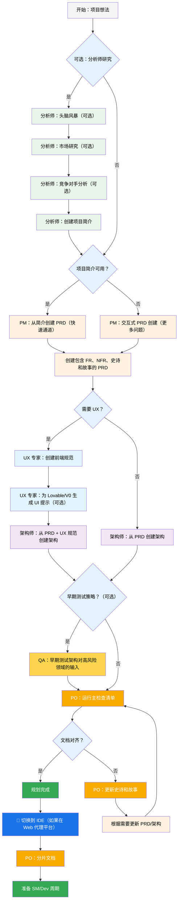

# BMad 方法 — 用户指南

本指南将帮助您理解并有效使用 BMad 方法进行敏捷 AI 驱动的规划和开发。

## BMad 规划和执行工作流

首先，这里是完整的标准绿地规划 + 执行工作流。棕地项目非常相似，但建议先理解这个绿地项目，即使是在处理棕地项目之前先在一个简单项目上理解。BMad 方法需要安装到新项目文件夹的根目录。对于规划阶段，您可以选择使用强大的网络代理执行，可能会产生更高质量的结果，成本仅为在某些代理工具中提供自己的 API 密钥或积分来完成所需成本的一小部分。对于规划，强大的思维模型和更大的上下文 - 以及与代理作为合作伙伴工作将获得最佳结果。

如果您要在棕地项目（现有项目）中使用 BMad 方法，请查看 **[棕地项目工作](./working-in-the-brownfield.md)**。

如果下面的图表无法渲染，请将 Markdown All in One 与 Markdown Preview Mermaid Support 插件安装到 VSCode（或其中一个分叉克隆）。使用这些插件，如果在打开时右键单击选项卡，应该有一个 Open Preview 选项，或查看 IDE 文档。

### 规划工作流（Web UI 或强大的 IDE 代理）

在开发开始之前，BMad 遵循结构化的规划工作流，理想情况下在 Web UI 中进行以实现成本效益：



#### Web UI 到 IDE 过渡

**关键过渡点**：一旦 PO 确认文档对齐，您必须从 Web UI 切换到 IDE 以开始开发工作流：

1. **复制文档到项目**：确保 `docs/prd.md` 和 `docs/architecture.md` 在您项目的 docs 文件夹中（或您可以在安装期间指定的自定义位置）
2. **切换到 IDE**：在您首选的代理 IDE 中打开项目
3. **文档分片**：使用 PO 代理分片 PRD，然后分片架构
4. **开始开发**：开始随后的核心开发周期

#### 规划产物（标准路径）

```text
PRD              → docs/prd.md
架构             → docs/architecture.md
分片史诗         → docs/epics/
分片故事         → docs/stories/
QA 评估          → docs/qa/assessments/
QA 门控          → docs/qa/gates/
```

### 核心开发周期（IDE）

一旦规划完成并且文档已分片，BMad 遵循结构化的开发工作流：

```mermaid
graph TD
    A["开发阶段开始"] --> B["SM：查看先前故事的开发/QA 注释"]
    B --> B2["SM：从分片史诗 + 架构起草下一个故事"]
    B2 --> S{"高风险故事？（可选）"}
    S -->|是| T["QA：对故事草稿进行 *risk + *design"]
    S -->|否| B3
    T --> U["创建测试策略和风险配置文件"]
    U --> B3{"PO：验证故事草稿（可选）"}
    B3 -->|请求验证| B4["PO：根据产物验证故事"]
    B3 -->|跳过验证| C{"用户批准"}
    B4 --> C
    C -->|已批准| D["Dev：顺序任务执行"]
    C -->|需要更改| B2
    D --> E["Dev：实现任务 + 测试"]
    E --> V{"开发中期 QA 检查？（可选）"}
    V -->|是| W["QA：*trace 或 *nfr 进行早期验证"]
    V -->|否| F
    W --> X["Dev：解决覆盖率/NFR 缺口"]
    X --> F["Dev：运行所有验证"]
    F --> G["Dev：标记为准备审查 + 添加注释"]
    G --> H{"用户验证"}
    H -->|请求 QA 审查| I["QA：测试架构审查 + 质量门控"]
    H -->|未经 QA 批准| M["重要：验证所有回归测试和 linting 都通过"]
    I --> J["QA：测试架构分析 + 主动重构"]
    J --> L{"QA 决定"}
    L -->|需要开发工作| D
    L -->|已批准| M
    H -->|需要修复| D
    M --> N["重要：在继续之前提交您的更改！"]
    N --> Y{"需要门控更新？"}
    Y -->|是| Z["QA：*gate 更新状态"]
    Y -->|否| K
    Z --> K["标记故事为完成"]
    K --> B

    style A fill:#f5f5f5,color:#000
    style B fill:#e8f5e9,color:#000
    style B2 fill:#e8f5e9,color:#000
    style S fill:#e3f2fd,color:#000
    style T fill:#ffd54f,color:#000
    style U fill:#ffd54f,color:#000
    style B3 fill:#e3f2fd,color:#000
    style B4 fill:#fce4ec,color:#000
    style C fill:#e3f2fd,color:#000
    style D fill:#e3f2fd,color:#000
    style E fill:#e3f2fd,color:#000
    style V fill:#e3f2fd,color:#000
    style W fill:#ffd54f,color:#000
    style X fill:#e3f2fd,color:#000
    style F fill:#e3f2fd,color:#000
    style G fill:#e3f2fd,color:#000
    style H fill:#e3f2fd,color:#000
    style I fill:#f9ab00,color:#fff
    style J fill:#ffd54f,color:#000
    style K fill:#34a853,color:#fff
    style L fill:#e3f2fd,color:#000
    style M fill:#ff5722,color:#fff
    style N fill:#d32f2f,color:#fff
    style Y fill:#e3f2fd,color:#000
    style Z fill:#ffd54f,color:#000
```



## 先决条件

在安装 BMad 方法之前，请确保您有：

- **Node.js** ≥ 18，**npm** ≥ 9
- **Git** 已安装并配置
- **（可选）** VS Code 与 "Markdown All in One" + "Markdown Preview Mermaid Support" 扩展

## 安装

### 可选

如果您想在 Web 上使用 Claude（Sonnet 4 或 Opus）、Gemini Gem（2.5 Pro）或自定义 GPT 进行规划：

1. 导航到 `dist/teams/`
2. 复制 `team-fullstack.txt`
3. 创建新的 Gemini Gem 或 CustomGPT
4. 上传带有说明的文件："您的关键操作说明已附加，请按照指示不要破坏角色"
5. 输入 `/help` 查看可用命令

### IDE 项目设置

```bash
# 交互式安装（推荐）
npx bmad-method install
```

### OpenCode

BMAD 通过项目级 `opencode.jsonc`/`opencode.json`（仅 JSON，无 Markdown 回退）与 OpenCode 集成。

- 安装：
  - 运行 `npx bmad-method install` 并在 IDE 列表中选择 `OpenCode`。
  - 安装程序将检测现有的 `opencode.jsonc`/`opencode.json` 或在缺失时创建最小的 `opencode.jsonc`。
  - 它将：
    - 确保 `instructions` 包含 `.bmad-core/core-config.yaml`（以及每个选定的扩展包的 `config.yaml`）。
    - 使用文件引用（`{file:./.bmad-core/...}`）合并 BMAD 代理和命令，幂等地。
    - 保留其他顶级字段和用户定义的条目。

- 前缀和冲突：
  -您可以选择加入代理键前缀 `bmad-` 和命令键前缀 `bmad:tasks:` 以避免名称冲突。
  - 如果键已存在且不是 BMAD 管理的，安装程序将跳过它并建议启用前缀。

- 添加的内容：
  - `instructions`：`.bmad-core/core-config.yaml` 加上任何选定的扩展包 `config.yaml` 文件。
  - `agent`：来自核心和选定包的 BMAD 代理。
    - `prompt`：`{file:./.bmad-core/agents/<id>.md}`（或包路径）
    - `mode`：编排器为 `primary`，否则为 `all`
    - `tools`：`{ write: true, edit: true, bash: true }`
    - `description`：从代理的 `whenToUse` 提取
  - `command`：来自核心和选定包的 BMAD 任务。
    - `template`：`{file:./.bmad-core/tasks/<id>.md}`（或包路径）
    - `description`：从任务的"目的"部分提取

- 仅选定包：
  - 安装程序仅包含您在早期步骤中选择的包（核心和选定的包）中的代理和任务。

- 更改后刷新：
  - 重新运行：
    ```bash
    npx bmad-method install -f -i opencode
    ```
  - 安装程序安全更新条目而不重复，并保留您的自定义字段和注释。

- 可选便利脚本：
  - 您可以向项目的 `package.json` 添加脚本以快速刷新：
    ```json
    {
      "scripts": {
        "bmad:opencode": "bmad-method install -f -i opencode"
      }
    }
    ```

### Codex（CLI 和 Web）

BMAD 通过 `AGENTS.md` 和提交的核心代理文件与 OpenAI Codex 集成。

- 两种安装模式：
  - Codex（仅本地）：保持 `.bmad-core/` 被忽略以进行本地开发。
    - `npx bmad-method install -f -i codex -d .`
  - Codex Web 启用：确保 `.bmad-core/` 被跟踪，以便您可以提交它用于 Codex Web。
    - `npx bmad-method install -f -i codex-web -d .`

- 生成的内容：
  - 项目根目录的 `AGENTS.md`，包含 BMAD 部分
    - 如何与 Codex 一起使用（CLI 和 Web）
    - 代理目录（标题、ID、何时使用）
    - 详细的每个代理部分，包含源路径、何时使用、激活短语和 YAML
    - 带有快速使用说明的任务
  - 如果存在 `package.json`，添加有用的脚本：
    - `bmad:refresh`、`bmad:list`、`bmad:validate`

- 使用 Codex：
  - CLI：在项目根目录运行 `codex` 并自然提示，例如"作为 dev，实现..."。
  - Web：提交 `.bmad-core/` 和 `AGENTS.md`，然后在 Codex 中打开仓库并以相同方式提示。

- 更改后刷新：
  - 重新运行适当的安装模式（`codex` 或 `codex-web`）以更新 `AGENTS.md` 中的 BMAD 块。

## 特殊代理

有两个 BMad 代理 — 将来它们将被合并为单个 BMad-Master。

### BMad-Master

这个代理可以执行所有其他代理可以执行的任何任务或命令，除了实际的故事实现。此外，这个代理可以通过访问知识库在 Web 上帮助解释 BMad 方法，并向您解释流程中的任何内容。

如果您不想在 dev 之外费心切换不同的代理，这个代理适合您。请记住，随着上下文的增长，代理的性能会下降，因此重要的是指示代理压缩对话并以压缩的对话作为初始消息开始新对话。经常这样做，最好在每个故事实现后。

### BMad-Orchestrator

这个代理不应在 IDE 中使用，它是一个重量级的、特殊用途的代理，使用大量上下文并且可以变形为任何其他代理。这仅用于促进 Web 包中的团队。如果您使用 Web 包，您将由 BMad Orchestrator 迎接。

### 代理如何工作

#### 依赖系统

每个代理都有一个 YAML 部分，定义其依赖项：

```yaml
dependencies:
  templates:
    - prd-template.md
    - user-story-template.md
  tasks:
    - create-doc.md
    - shard-doc.md
  data:
    - bmad-kb.md
```

**关键点：**

- 代理只加载它们需要的资源（精简上下文）
- 依赖项在打包期间自动解析
- 资源在代理之间共享以保持一致性

#### 代理交互

**在 IDE 中：**

```bash
# 一些 IDE，如 Cursor 或 Windsurf 例如，使用手动规则，因此交互使用 '@' 符号
@pm 为任务管理应用创建 PRD
@architect 设计系统架构
@dev 实现用户身份验证

# 一些 IDE，如 Claude Code，使用斜杠命令
/pm 创建用户故事
/dev 修复登录错误
```

#### 交互模式

- **增量模式**：逐步进行，需要用户输入
- **YOLO 模式**：快速生成，最少交互

## IDE 集成

### IDE 最佳实践

- **上下文管理**：仅保留相关文件在上下文中，保持文件尽可能精简和专注
- **代理选择**：为任务使用适当的代理
- **迭代开发**：在小而专注的任务中工作
- **文件组织**：保持干净的项目结构
- **定期提交**：经常保存您的工作

## 测试架构师（QA 代理）

### 概述

BMAD 中的 QA 代理不仅仅是"高级开发审查员" — 它是**测试架构师**，在测试策略、质量门控和基于风险的测试方面拥有深厚的专业知识。名为 Quinn，这个代理在质量事务上提供咨询权威，同时在安全的情况下主动改进代码。

#### 快速开始（基本命令）

```bash
@qa *risk {故事}       # 在开发前评估风险
@qa *design {故事}     # 创建测试策略
@qa *trace {故事}      # 在开发期间验证测试覆盖率
@qa *nfr {故事}        # 检查质量属性
@qa *review {故事}     # 全面评估 → 编写门控
```

#### 命令别名（测试架构师）

文档使用简写形式以便方便。两种样式都有效：

```text
*risk    → *risk-profile
*design  → *test-design
*nfr     → *nfr-assess
*trace   → *trace-requirements 或只是 *trace
*review  → *review
*gate    → *gate
```

### 核心能力

#### 1. 风险分析（`*risk`）

**何时：**故事草稿后，开发开始前（最早干预点）

识别和评估实现风险：

- **类别**：技术、安全、性能、数据、业务、运营
- **评分**：概率 × 影响分析（1-9 级）
- **缓解**：每个已识别风险的具体策略
- **门控影响**：风险 ≥9 触发 FAIL，≥6 触发 CONCERNS（权威规则见 `tasks/risk-profile.md`）

#### 2. 测试设计（`*design`）

**何时：**故事草稿后，开发开始前（指导编写什么测试）

创建全面的测试策略，包括：

- 每个验收标准的测试场景
- 适当的测试级别建议（单元 vs 集成 vs E2E）
- 基于风险的优先级排序（P0/P1/P2）
- 测试数据要求和模拟策略
- CI/CD 集成的执行策略

**示例输出：**

```yaml
test_summary:
  total: 24
  by_level:
    unit: 15
    integration: 7
    e2e: 2
  by_priority:
    P0: 8 # 必须有 - 链接到关键风险
    P1: 10 # 应该有 - 中等风险
    P2: 6 # 最好有 - 低风险
```

#### 3. 需求跟踪（`*trace`）

**何时：**开发期间（中期实现检查点）

将需求映射到测试覆盖率：

- 记录哪些测试验证每个验收标准
- 使用 Given-When-Then 以便清晰（仅文档，不是 BDD 代码）
- 识别覆盖率缺口及严重性评级
- 为审计目的创建可追溯性矩阵

#### 4. NFR 评估（`*nfr`）

**何时：**开发期间或早期审查（验证质量属性）

验证非功能需求：

- **核心四项**：安全、性能、可靠性、可维护性
- **基于证据**：寻找实际实现证明
- **门控集成**：NFR 失败直接影响质量门控

#### 5. 综合测试架构审查（`*review`）

**何时：**开发完成后，故事标记为"准备审查"

当您运行 `@qa *review {story}` 时，Quinn 执行：

- **需求可追溯性**：将每个验收标准映射到其验证测试
- **测试级别分析**：确保在单元、集成和 E2E 级别进行适当测试
- **覆盖率评估**：识别缺口和冗余测试覆盖
- **主动重构**：在安全时直接改进代码质量
- **质量门控决策**：基于发现发布 PASS/CONCERNS/FAIL 状态

#### 6. 质量门控（`*gate`）

**何时：**审查修复后或需要更新门控状态时

管理质量门控决策：

- **确定性规则**：PASS/CONCERNS/FAIL 的明确标准
- **并行权威**：QA 拥有 `docs/qa/gates/` 中的门控文件
- **咨询性质**：提供建议，不阻塞
- **豁免支持**：在需要时记录接受的风险

**注意：**门控是咨询性的；团队选择自己的质量标准。WAIVED 需要原因、批准者和过期日期。有关架构和评分，请参阅 `templates/qa-gate-tmpl.yaml` 的模式以及 `tasks/review-story.md`（门控规则）和 `tasks/risk-profile.md`。

### 与测试架构师合作

#### 与 BMad 工作流的集成

测试架构师在整个开发生命周期中提供价值。以下是在何时以及如何利用每种能力：

| **阶段**          | **命令** | **何时使用**         | **价值**                  | **输出**                                                     |
| ------------------ | ----------- | ----------------------- | -------------------------- | -------------------------------------------------------------- |
| **故事起草** | `*risk`     | SM 起草故事后        | 早期识别陷阱            | `docs/qa/assessments/{epic}.{story}-risk-{YYYYMMDD}.md`        |
|                    | `*design`   | 风险评估后           | 指导 dev 测试策略    | `docs/qa/assessments/{epic}.{story}-test-design-{YYYYMMDD}.md` |
| **开发**    | `*trace`    | 中期实现             | 验证测试覆盖率        | `docs/qa/assessments/{epic}.{story}-trace-{YYYYMMDD}.md`       |
|                    | `*nfr`      | 构建功能时          | 早期发现质量问题     | `docs/qa/assessments/{epic}.{story}-nfr-{YYYYMMDD}.md`         |
| **审查**         | `*review`   | 故事标记完成         | 全面质量评估           | 故事中的 QA 结果 + 门控文件                                |
| **审查后**    | `*gate`     | 解决问题后          | 更新质量决策           | 更新的 `docs/qa/gates/{epic}.{story}-{slug}.yml`              |

#### 示例命令

```bash
# 规划阶段 - 在开发开始前运行这些
@qa *risk {故事草稿}     # 可能会出什么问题？
@qa *design {故事草稿}   # 我们应该写什么测试？

# 开发阶段 - 在编码期间运行这些
@qa *trace {故事}          # 我们是否测试了所有内容？
@qa *nfr {故事}            # 我们是否达到质量标准？

# 审查阶段 - 开发完成时运行
@qa *review {故事}         # 全面评估 + 重构

# 审查后 - 解决问题后运行
@qa *gate {故事}           # 更新门控状态
```

### 强制的质量标准

Quinn 强制执行这些测试质量原则：

- **无不稳定测试**：通过适当的异步处理确保可靠性
- **无硬等待**：仅动态等待策略
- **无状态和并行安全**：测试独立运行
- **自清理**：测试管理自己的测试数据
- **适当的测试级别**：逻辑用单元，交互用集成，旅程用 E2E
- **显式断言**：将断言保留在测试中，而不是辅助函数中

### 门控状态含义

- **PASS**：满足所有关键要求，无阻塞问题
- **CONCERNS**：发现非关键问题，团队应审查
- **FAIL**：应解决的关键问题（安全风险、缺少 P0 测试）
- **WAIVED**：问题已确认但被团队明确接受

### 特殊情况

**高风险故事：**

- 在开发开始前始终运行 `*risk` 和 `*design`
- 考虑开发中期 `*trace` 和 `*nfr` 检查点

**复杂集成：**

- 在开发期间运行 `*trace` 以确保所有集成点都经过测试
- 后续运行 `*nfr` 以验证集成的性能

**性能关键：**

- 在开发期间早期并经常运行 `*nfr`
- 不要等到审查才发现性能问题

**棕地/遗留代码：**

- 从 `*risk` 开始识别回归危险
- 使用 `*review` 并额外关注向后兼容性

### 最佳实践

- **早期参与**：在故事起草期间运行 `*design` 和 `*risk`
- **基于风险的焦点**：让风险分数驱动测试优先级
- **迭代改进**：使用 QA 反馈改进未来的故事
- **门控透明度**：与团队分享门控决策
- **持续学习**：QA 记录模式以供团队知识共享
- **棕地关注**：在现有系统中额外关注回归风险

### 输出路径参考

测试架构师输出存储位置的快速参考：

```text
*risk-profile  → docs/qa/assessments/{epic}.{story}-risk-{YYYYMMDD}.md
*test-design   → docs/qa/assessments/{epic}.{story}-test-design-{YYYYMMDD}.md
*trace         → docs/qa/assessments/{epic}.{story}-trace-{YYYYMMDD}.md
*nfr-assess    → docs/qa/assessments/{epic}.{story}-nfr-{YYYYMMDD}.md
*review        → 故事中的 QA 结果部分 + 门控文件引用
*gate          → docs/qa/gates/{epic}.{story}-{slug}.yml
```

## 技术偏好系统

BMAD 通过位于 `.bmad-core/data/` 中的 `technical-preferences.md` 文件包含个性化系统 - 这可以帮助偏向 PM 和架构师推荐您对设计模式、技术选择或您想要在此处放置的任何其他内容的偏好。

### 与 Web 包一起使用

创建自定义 Web 包或上传到 AI 平台时，包含您的 `technical-preferences.md` 内容，以确保代理从一开始就拥有您的偏好。

## 核心配置

`.bmad-core/core-config.yaml` 文件是一个关键配置，使 BMAD 能够无缝处理不同的项目结构，将来会提供更多选项。目前最重要的是 yaml 中的 devLoadAlwaysFiles 列表部分。

### 开发者上下文文件

定义 dev 代理应始终加载的文件：

```yaml
devLoadAlwaysFiles:
  - docs/architecture/coding-standards.md
  - docs/architecture/tech-stack.md
  - docs/architecture/project-structure.md
``

您需要从分片架构中验证这些文档存在，它们尽可能精简，并包含您希望 dev 代理始终加载到其上下文中的确切信息。这些是代理将遵循的规则。

随着项目的增长和代码开始构建一致的模式，编码标准应减少为仅包含代理仍需要强制执行的标准。代理将查看文件中的周围代码以推断与当前任务相关的编码标准。

## 获取帮助

- **Discord 社区**：[加入 Discord](https://discord.gg/gk8jAdXWmj)
- **GitHub 问题**：[报告错误](https://github.com/bmadcode/bmad-method/issues)
- **文档**：[浏览文档](https://github.com/bmadcode/bmad-method/docs)
- **YouTube**：[BMadCode 频道](https://www.youtube.com/@BMadCode)

## 结论

记住：BMAD 旨在增强您的开发过程，而不是替代您的专业知识。将其用作加速项目的强大工具，同时保持对设计决策和实现细节的控制。
