# CLAUDE.md - FactoryOS 项目文档

## 变更记录 (Changelog)

- 2025-10-15: 初始化项目架构文档，生成模块结构图和导航

## 项目概述

FactoryOS 是一个基于 Vue Vben Admin 5.5.9 的现代化 monorepo 项目，专为工厂管理系统设计。项目采用 Vue 3、Vite、TypeScript 等现代前端技术栈，提供完整的中后台管理系统解决方案。

## 架构总览

### 技术栈

**核心技术**
- **Vue 3.5+** - 渐进式 JavaScript 框架
- **TypeScript 5.8+** - 类型安全的 JavaScript
- **Vite 7.1+** - 现代前端构建工具
- **Pinia 3.0+** - Vue 状态管理库

**UI 框架**
- **Ant Design Vue 4.2+** - 企业级 UI 设计语言
- **Tailwind CSS 3.4+** - 实用优先的 CSS 框架

**开发工具**
- **Turbo** - Monorepo 构建工具
- **pnpm 10.14+** - 包管理器
- **ESLint + Prettier** - 代码质量工具
- **Vitest** - 单元测试框架
- **Playwright** - E2E 测试框架

## 模块结构图

```mermaid
graph TD
    A["(根) FactoryOS"] --> B["apps"];
    B --> C["backend-mock"];
    B --> D["web-antd"];
    A --> E["packages"];
    E --> F["@core"];
    E --> G["effects"];
    E --> H["其他工具包"];
    F --> I["base"];
    F --> J["composables"];
    F --> K["preferences"];
    F --> L["ui-kit"];
    I --> M["design"];
    I --> N["icons"];
    I --> O["shared"];
    I --> P["typings"];
    L --> Q["form-ui"];
    L --> R["layout-ui"];
    L --> S["menu-ui"];
    L --> T["popup-ui"];
    L --> U["shadcn-ui"];
    L --> V["tabs-ui"];
    G --> W["access"];
    G --> X["common-ui"];
    G --> Y["hooks"];
    G --> Z["layouts"];
    G --> AA["plugins"];
    G --> AB["request"];
    H --> AC["constants"];
    H --> AD["locales"];
    H --> AE["stores"];
    H --> AF["styles"];
    H --> AG["types"];
    H --> AH["utils"];
    A --> AI["internal"];
    AI --> AJ["node-utils"];
    AI --> AK["tailwind-config"];
    AI --> AL["tsconfig"];
    AI --> AM["vite-config"];
    A --> AN["scripts"];
    A --> AO["playground"];

    click C "./apps/backend-mock/CLAUDE.md" "查看 backend-mock 模块文档"
    click D "./apps/web-antd/CLAUDE.md" "查看 web-antd 模块文档"
    click F "./packages/@core/CLAUDE.md" "查看 @core 核心包文档"
    click G "./packages/effects/CLAUDE.md" "查看 effects 效果包文档"
    click I "./packages/@core/base/CLAUDE.md" "查看 base 基础包文档"
    click J "./packages/@core/composables/CLAUDE.md" "查看 composables 组合式函数文档"
    click K "./packages/@core/preferences/CLAUDE.md" "查看 preferences 偏好设置文档"
    click L "./packages/@core/ui-kit/CLAUDE.md" "查看 ui-kit 组件库文档"
    click W "./packages/effects/access/CLAUDE.md" "查看 access 权限模块文档"
    click X "./packages/effects/common-ui/CLAUDE.md" "查看 common-ui 通用UI文档"
    click Y "./packages/effects/hooks/CLAUDE.md" "查看 hooks 钩子函数文档"
    click Z "./packages/effects/layouts/CLAUDE.md" "查看 layouts 布局模块文档"
    click AA "./packages/effects/plugins/CLAUDE.md" "查看 plugins 插件模块文档"
    click AB "./packages/effects/request/CLAUDE.md" "查看 request 请求模块文档"
```



## 模块索引

| 模块名称 | 路径 | 类型 | 语言 | 描述 |
|---------|------|------|------|------|
| **backend-mock** | apps/backend-mock | 应用 | TypeScript | 基于 Nitro 的 Mock 后端服务 |
| **web-antd** | apps/web-antd | 应用 | TypeScript | 主应用 (Ant Design Vue) |
| **@core/base** | packages/@core/base | 包 | TypeScript | 基础功能 (设计系统、共享工具、类型定义) |
| **@core/composables** | packages/@core/composables | 包 | TypeScript | Vue 组合式函数 |
| **@core/preferences** | packages/@core/preferences | 包 | TypeScript | 偏好设置 |
| **@core/ui-kit** | packages/@core/ui-kit | 包 | TypeScript | UI 组件库 |
| **effects** | packages/effects | 包 | TypeScript | 功能效果包 (布局、插件等) |
| **constants** | packages/constants | 包 | TypeScript | 常量定义 |
| **icons** | packages/icons | 包 | TypeScript | 图标包 |
| **locales** | packages/locales | 包 | TypeScript | 国际化 |
| **stores** | packages/stores | 包 | TypeScript | 状态管理 |
| **styles** | packages/styles | 包 | TypeScript | 样式 |
| **types** | packages/types | 包 | TypeScript | 类型定义 |
| **utils** | packages/utils | 包 | TypeScript | 工具函数 |

## 项目结构

```
├── apps/                    # 应用程序
│   ├── backend-mock/       # Mock 后端服务 (Nitro)
│   └── web-antd/           # 主应用 (Ant Design Vue)
├── packages/               # 共享包
│   ├── @core/             # 核心功能包
│   │   ├── base/          # 基础功能 (设计系统、共享工具、类型定义)
│   │   ├── composables/   # Vue 组合式函数
│   │   ├── preferences/   # 偏好设置
│   │   └── ui-kit/        # UI 组件库
│   ├── effects/           # 功能效果包 (布局、插件等)
│   ├── business/          # 业务相关包
│   └── [其他工具包]        # 图标、样式、工具等
├── internal/              # 内部工具
├── scripts/               # 构建脚本
└── playground/           # 测试环境
```

## 运行与开发

### 环境要求
- Node.js >= 20.10.0
- pnpm >= 9.12.0

### 常用命令

```bash
# 安装依赖
pnpm install

# 启动开发服务器 (所有应用)
pnpm dev

# 启动特定应用
pnpm dev:antd              # 启动主应用 (Ant Design)
pnpm dev:docs              # 启动文档
pnpm dev:play              # 启动测试环境

# 构建所有项目
pnpm build

# 构建特定应用
pnpm build:antd

# 分析构建包大小
pnpm build:analyze

# 运行测试
pnpm test:unit            # 单元测试
pnpm test:e2e             # E2E 测试

# 类型检查
pnpm check:type

# 代码检查
pnpm lint
pnpm format              # 代码格式化

# 全面检查 (循环依赖、依赖项、类型、拼写)
pnpm check
```

## 测试策略

### 单元测试
- 使用 Vitest + happy-dom
- 测试文件位置：各包目录下的 `__tests__` 文件夹
- 命名模式：`*.test.ts` 或 `*.spec.ts`

### E2E 测试
- 使用 Playwright
- 测试文件位置：`playground/__tests__/e2e/`
- 主要测试用户流程和关键功能

## 编码规范

### 代码质量标准
- 单个文件代码不超过1000行
- 单个函数不超过50行
- 必须有完整的注释，包括函数说明、参数说明、返回值说明
- 变量命名必须有意义，禁止使用a、b、c这种无意义命名
- 复杂逻辑必须有注释解释

### 错误处理原则
- 所有可能的错误都必须处理
- 错误信息要明确，便于调试
- 不允许空catch块
- 关键路径必须有日志记录

### 性能要求
- 数据库查询必须有索引支持
- 循环内不允许执行数据库操作
- 大数据量处理必须分批进行
- 缓存策略要明确

### 安全规范
- 所有用户输入必须验证
- 密码必须加密存储
- API接口必须有权限控制
- 敏感信息不能记录到日志

## AI 使用指引

### 项目结构理解
1. 这是一个 monorepo 项目，使用 pnpm workspace 管理依赖
2. 主要应用在 `apps/` 目录下
3. 共享包在 `packages/` 目录下
4. 核心功能在 `@core` 包中
5. UI 组件库使用 Ant Design Vue

### 开发流程
1. 首先阅读相关模块的 CLAUDE.md 文件
2. 理解模块之间的依赖关系
3. 遵循项目的代码规范和测试策略
4. 确保类型安全，使用 TypeScript 严格模式

### 常见问题
1. 如果遇到依赖问题，尝试运行 `pnpm reinstall`
2. 如果遇到类型错误，检查是否正确导入了类型定义
3. 如果遇到构建问题，检查是否正确配置了 Vite
4. 如果遇到测试问题，检查测试文件是否正确放置

## 开发注意事项

1. 所有新功能应该先在 `playground` 中测试
2. 遵循项目的代码规范和提交规范
3. 修改核心包时需要考虑对其他应用的影响
4. 使用 TypeScript 严格模式确保类型安全

### 构建优化
- 支持增量构建和缓存
- 自动代码分割和懒加载
- 生产环境优化和压缩

### Mock 后端服务
项目包含一个基于 Nitro 的 Mock 后端服务，默认运行在 `http://localhost:5320/api`，在 `vite.config.mts` 中配置了代理规则。

### 应用架构
- **模块化设计**: 基于 workspace 的 monorepo 架构
- **组件化开发**: 使用 @core/ui-kit 提供统一的 UI 组件
- **类型安全**: 全面的 TypeScript 类型定义
- **国际化**: 完整的 i18n 支持
- **主题系统**: 支持多主题切换

### 包管理
使用 pnpm workspace 管理包依赖，支持:
- `workspace:*` 协议用于内部包引用
- `catalog:` 协议用于统一版本管理
- 自动依赖提升和去重