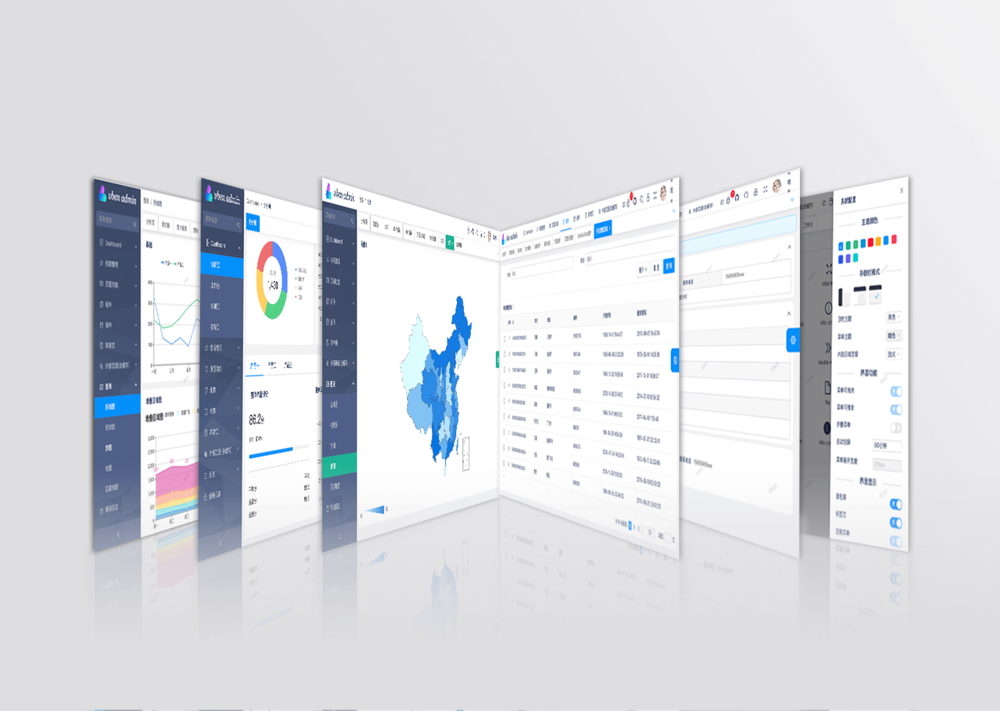

<p align="center">
  <a href="https://github.com/anncwb/vue-vben-admin" target="_blank">
    
  </a>
</p>
<h2 align="center">VUE VBEN ADMIN2.0</h2>

[Chinese](./README.zh-CN.md) | **English**

[CHANGELOG](CHANGELOG.en_US.md)

- [Introduction](#introduction)
- [GitHub](#github)
  - [Thin](#thin)
- [Preview](#preview)
- [Documentation](#documentation)
- [Preinstallation](#preinstallation)
  - [Environmental requirements](#environmental-requirements)
  - [UI framework](#ui-framework)
  - [Icon](#icon)
  - [Plugin](#plugin)
  - [Suggested development environment](#suggested-development-environment)
- [Install](#install)
- [Usage](#usage)
  - [Development environment](#development-environment)
  - [Build](#build)
  - [Format](#format)
  - [Other](#other)
- [Git submit specifications](#git-submit-specifications)
- [Code contribution](#code-contribution)
- [Finished features](#finished-features)
- [Developing features](#developing-features)
- [Browser support](#browser-support)
- [Plugins](#plugins)

## Introduction

The project is based on the vue3 style background management system implemented by ʻant-design-vue`, `typescript`,`vue3.0`,`vite`,`tsx`,

## GitHub

[vue-vben-admin2.0](https://github.com/anncwb/vue-vben-admin) - `main` branch

### Thin

[vue-vben-admin-thin-next](https://github.com/anncwb/vben-admin-thin-next)

## Preview

- [2.0 preview](https://vvbin.cn/next/)

- [2.0 Thin Preview](https://vvbin.cn/thin/next/)

Account for test: vben/123456

<p align="center">
    
    
    
</p>

## Documentation

The documentation for 2.0 hasn't started yet, it will be provided later.

## Preinstallation

### Environmental requirements

- `Node.js`: - Version > `12.0.0` .
- `yarn` : - Package management tool.

### UI framework

- [Tailwind CSS](https://tailwindcss.com/) - 2.0.0-beta.5 has deleted.
- [Ant Design Vue 2.0](https://2x.antdv.com/docs/vue/introduce-cn/)

### Icon

- [Ant Design Vue Icon Component](https://2x.antdv.com/components/icon-cn/) - Icon which is imported on demand.
- [Iconify](https://iconify.design) - Icon can be used [Icônes](https://icones.netlify.app/)
- [PurgeIcons](https://github.com/antfu/purge-icons) - Icon which is used by build.

### Plugin

- [Vue Router Next](https://github.com/vuejs/vue-router-next)
- [Vuex Next](https://github.com/vuejs/vuex)
- [vuex-module-decorators](https://github.com/championswimmer/vuex-module-decorators) - vuex modular
- [vite-plugin-mock](https://github.com/anncwb/vite-plugin-mock) - Mock plugin base on vite
- [vue-i18n](https://github.com/intlify/vue-i18n-next) - Internationalization
- [lodash-es](https://github.com/lodash/lodash) - JavaScript utility library
- [axios](https://github.com/axios/axios) - Http data interaction
- [TypeScript](https://www.typescriptlang.org/)

### Suggested development environment

- `Git`: - Tool of version management
- `Visual Studio Code` - (VSCode): Latest version
  - [VS Code Extensions](./.vscode/extensions.json)
    - [Iconify IntelliSense](https://marketplace.visualstudio.com/items?itemName=antfu.iconify)
    - [Tailwind CSS IntelliSense](https://marketplace.visualstudio.com/items?itemName=bradlc.vscode-tailwindcss) - Tailwind css style association
    - [Vetur](https://marketplace.visualstudio.com/items?itemName=octref.vetur) - Essential for vue development
    - [ESLint](https://marketplace.visualstudio.com/items?itemName=dbaeumer.vscode-eslint) - Checking script code
    - [Prettier](https://marketplace.visualstudio.com/items?itemName=esbenp.prettier-vscode) - Code formatting
    - [Stylelint](https://marketplace.visualstudio.com/items?itemName=stylelint.vscode-stylelint) - Css formatting

## Install

```bash
#  Make git case sensitive to file names
git config core.ignorecase false

# Pull code of the project
git clone https://github.com/anncwb/vue-vben-admin.git vue-vben-admin-2.0

cd vue-vben-admin-2.0

# If you use other package management tool, you can install it by yourself
#  if you hasn't install yarn, please run: npm install -g yarn
yarn install

```

## Usage

### Development environment

```bash
yarn serve
```

### Build

```bash

yarn build # build

yarn build:no-cache # build, cache will be removed before build

yarn report # Generate build package report preview
```

### Format

```bash
yarn lint:stylelint # css formatting

yarn lint:prettier # js/ts code formatting
```

### Other

```bash
yarn reinstall # Remove dependencies and reinstall, supported window

yarn preview # Build and preview in local

yarn log # Generate CHANGELOG

yarn clean:cache # Delete cache

yarn clean:lib # Delete node_modules, supported window
```

## Git submit specifications

- Refer to [vue](https://github.com/vuejs/vue/blob/dev/.github/COMMIT_CONVENTION.md) specifications ([Angular](https://github.com/conventional-changelog/conventional-changelog/tree/master/packages/conventional-changelog-angular))

  - `feat` Add new features
  - `fix` Fix problem/BUG
  - `style` Code style related and doesn't affect the running result
  - `perf` Optimization/performance improvement
  - `refactor` Refactor
  - `revert` Undo edit
  - `test` Test related
  - `docs` Documentation/notes
  - `chore` Dependent update/scaffolding configuration modification etc
  - `workflow` Workflow improvements
  - `ci` Continuous integration
  - `types` Update file of type definition
  - `wip` Developing

## Code contribution

1. Fork code!
2. Create your own branch: `git checkout -b feat/xxxx`
3. Submit your changes: `git commit -am 'feat(function): add xxxxx'`
4. Push your branch: `git push origin feat/xxxx`
5. submit`pull request`

## Finished features

- [x] Project construction (based on vite）)
- [x] Login and exit
- [x] Menu (can search, drag and drop and menu layout)
- [x] Multiple tabs/breadcrumbs
- [x] Permission management base on role
- [x] Permission management base on background
- [x] The separation of routing and menu settings
- [x] Collapsible sidebar
- [x] Draggable sidebar
- [x] Multi-tab mode/global control
- [x] Menu search
- [x] Page loading
- [x] Scroll bar component
- [x] Pop-up window expansion (dragable, full screen, adaptive height)
- [x] Mock data
- [x] hook Package
- [x] Form component
- [x] Right-click menu
- [x] Watermark plugin
- [x] Animation component
- [x] QR code plugin
- [x] Internationalization plugin
- [x] Details component
- [x] Validation component
- [x] Tree component
- [x] Picture preview component
- [x] Table component
- [x] Chart library
- [x] Digital animation
- [x] First screen loading waiting animation
- [x] Extract the production environment profile
- [x] Build Gzip
- [x] System performance optimization
- [x] Data import and export
- [x] Global error handling
- [x] Rich text component
- [x] Upload component

## Developing features

- [ ] Theme configuration
- [ ] Dark theme
- [ ] Build CDN

If you have more components/functions/suggestions/bugs/, welcome to submit pr or issue.

## Browser support

It is recommended to use the `Chrome` browser for local development. Development in the Firefox browser is relatively slow.

Support modern browsers, Not currently supported ie11，Follow-up consideration support ie11

| [](http://godban.github.io/browsers-support-badges/)</br>IE | [](http://godban.github.io/browsers-support-badges/)</br>Edge | [](http://godban.github.io/browsers-support-badges/)</br>Firefox | [](http://godban.github.io/browsers-support-badges/)</br>Chrome | [](http://godban.github.io/browsers-support-badges/)</br>Safari |
| :-: | :-: | :-: | :-: | :-: |
| not support | last 2 versions | last 2 versions | last 2 versions | last 2 versions |

More browsers can view [Can I Use Es Module](https://caniuse.com/?search=ES%20Module)

## Plugins

If these plugins are helpful to you, you can give a star

- [vite-plugin-mock](https://github.com/anncwb/vite-plugin-mock)
- [vite-plugin-html](https://github.com/anncwb/vite-plugin-html)
- [vite-plugin-style-import](https://github.com/anncwb/vite-plugin-style-import)
- [vite-plugin-theme](https://github.com/anncwb/vite-plugin-theme)
- [vite-plugin-imagemin](https://github.com/anncwb/vite-plugin-imagemin)
