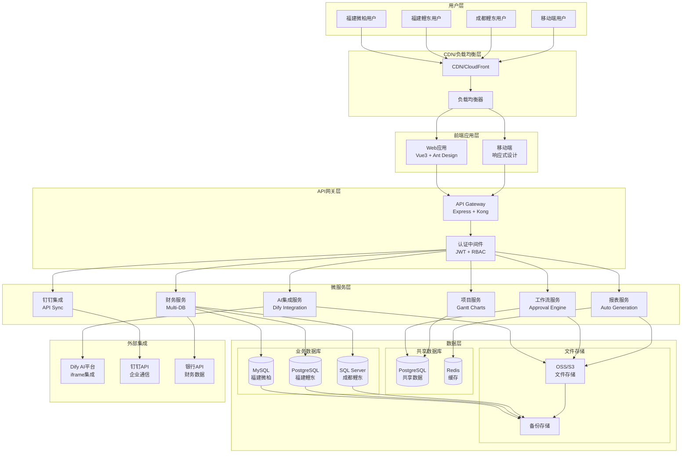
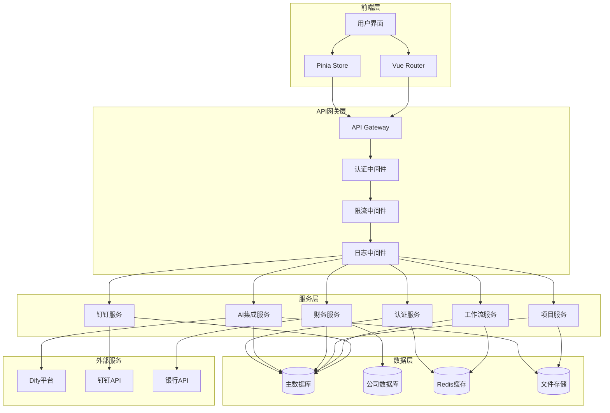
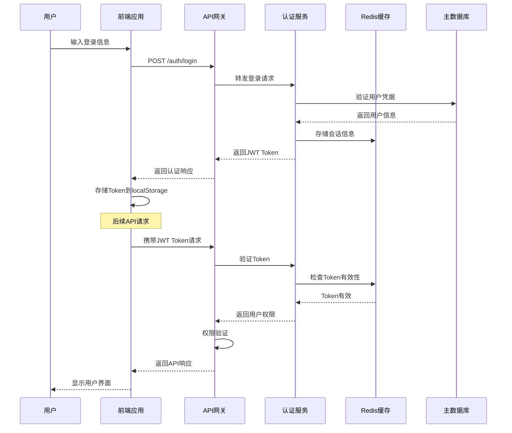
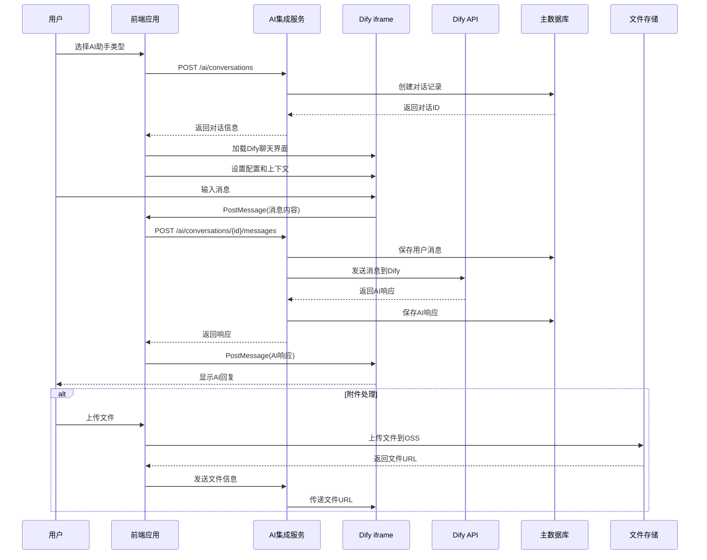
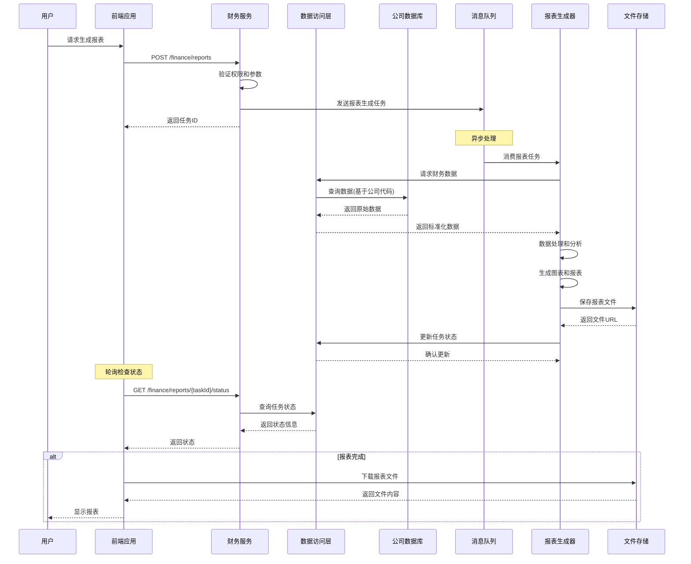
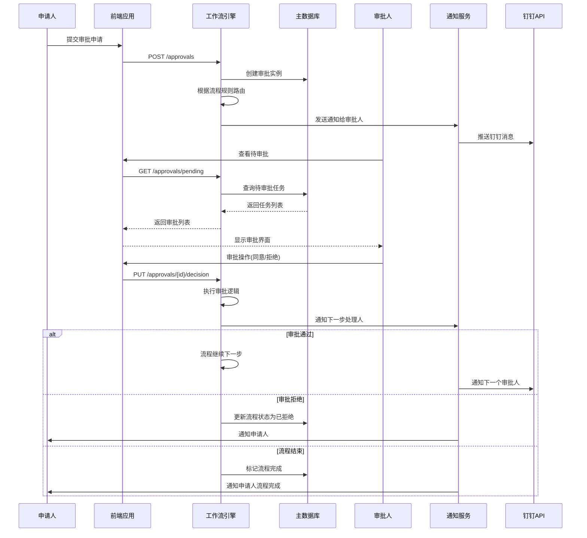
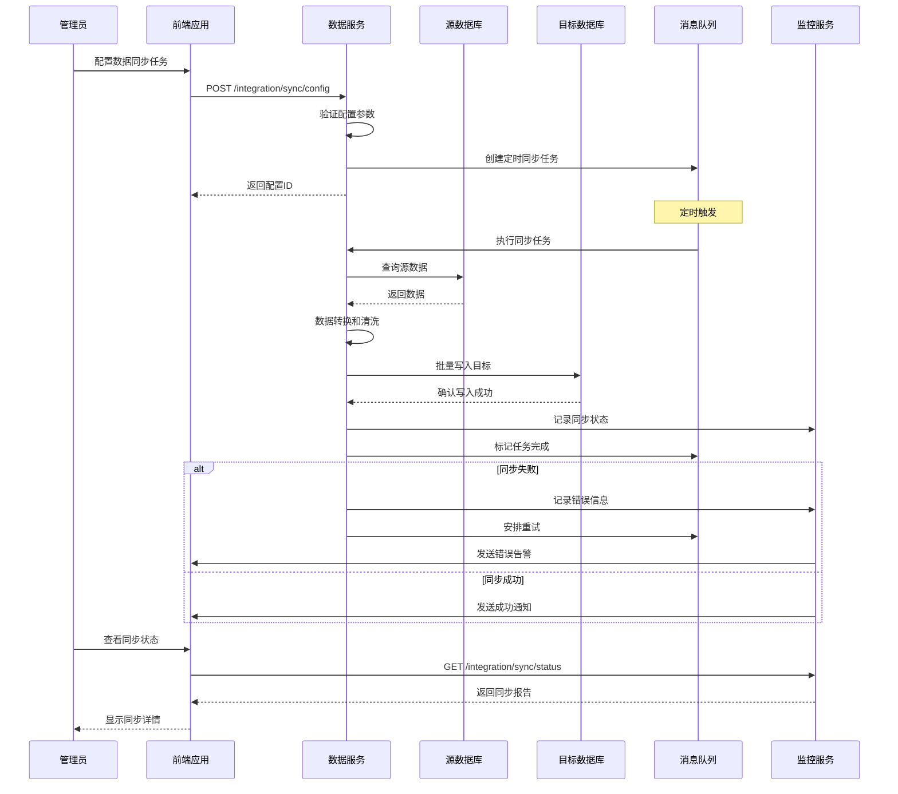

# FactoryOS 企业级 AI 协作平台全栈架构文档

## Introduction

这个文档概述了 FactoryOS 企业级 AI 协作平台的完整全栈架构，包括后端系统、前端实现及其集成。它作为 AI 驱动开发的单一事实来源，确保整个技术栈的一致性。

这种统一的方法结合了传统上分离的后端和前端架构文档，为现代全栈应用程序简化了开发流程，因为这些关注点日益紧密地交织在一起。

### Starter Template or Existing Project

根据 PRD 分析，FactoryOS 基于现有的 Vue Vben Admin 5.5.9 monorepo 项目：

**现有项目基础：**

- **框架**: Vue Vben Admin 5.5.9
- **技术栈**: Vue 3.5+, TypeScript 5.8+, Vite 7.1+, Pinia 3.0+
- **架构**: Monorepo with pnpm workspace
- **UI 组件库**: Ant Design Vue 4.2+
- **构建工具**: Turbo + Vite
- **测试**: Vitest + Playwright

**约束条件：**

- 必须保持现有技术栈兼容性
- 需要扩展现有权限系统支持多公司架构
- 集成 Dify 平台需要安全 iframe 嵌入
- 支持现有模块化架构模式

### Change Log

| 日期       | 版本 | 描述             | 作者                |
| ---------- | ---- | ---------------- | ------------------- |
| 2025-10-17 | 1.0  | 初始架构文档创建 | Winston (Architect) |
| 2025-10-23 | 1.1  | 增补AI融合式导航/交互架构 | FactoryOS AI        |

---

## High Level Architecture

### Technical Summary

FactoryOS 企业级 AI 协作平台采用微服务架构设计，基于现有的 Vue Vben Admin monorepo 结构扩展。前端使用 Vue 3 + TypeScript + Ant Design Vue 构建统一的企业级界面，后端采用 Node.js + Express/Fastify 实现微服务架构，通过 API 网关统一管理。系统通过安全的 iframe 集成 Dify 平台提供 AI 能力，支持多数据源统一访问和企业级权限管理。整体架构部署在云平台上，确保高可用性和横向扩展能力，同时通过数据隔离和加密机制保障三家公司数据安全。

### Platform and Infrastructure Choice

**推荐方案：混合云架构**

**平台**: 阿里云 + AWS 混合云 **核心服务**:

- **阿里云**：ECS、RDS、Redis、OSS、钉钉集成
- **AWS**：S3、Lambda、CloudFront（国际化备份）
- **部署区域**: 华东1(杭州) + 新加坡

### Repository Structure

**结构**: Monorepo (保持现有结构) **Monorepo 工具**: pnpm workspace + Turbo (现有) **包组织策略**: 基于功能域的模块化设计

```
factoryos/
├── apps/
│   ├── web-antd/              # 主应用 (现有)
│   ├── backend-mock/          # Mock服务 (现有)
│   └── ai-integration/        # AI集成服务 (新增)
├── packages/
│   ├── @core/                 # 核心包 (现有)
│   ├── effects/               # 效果包 (现有)
│   ├── business/              # 业务包 (新增)
│   │   ├── auth/             # 认证授权
│   │   ├── ai/               # AI相关
│   │   ├── finance/          # 财务管理
│   │   └── workflow/         # 工作流
│   └── integration/           # 集成包 (新增)
│       ├── dingtalk/         # 钉钉集成
│       ├── dify/             # Dify集成
│       └── database/         # 数据库集成
├── internal/                  # 内部工具 (现有)
└── infrastructure/           # 基础设施代码 (新增)
    ├── terraform/           # Terraform配置
    └── docker/              # 容器配置
```

### Information Architecture & Navigation

为支持“AI 融合式、非独立助手”的交互理念，信息架构按业务域分层，所有模块的第一个子项固定为“对话（模块）”。顶栏统一提供“命令面板/全局搜索”。

- 工作台：今日概览、待办/我发起/我参与、最近活动与通知、全局搜索/命令面板
- 项目管理：对话（项目）、项目列表、甘特图、看板、成本分析、周交付、报表与仪表盘、模板中心
- 财务管理：对话（财务）、报表（日/周/月）、指标预警、历史采购对比、财务仪表盘
- 审批管理：对话（审批）、发起申请、待我处理、我发起的、审批历史、流程配置与规则
- 员工管理：对话（人事）、组织架构、员工档案、效率评估、报告生成（周报/月报）、技能矩阵
- 资料库：对话（资料）、方案资料库、设计零件资料库、PLC 设计资料库、智能检索、上传与版本
- 目标与 BI：对话（目标）、目标管理、目标审核、业务数据挖掘、宣传材料生成、业务智能仪表盘
- 数据与集成：对话（数据）、钉钉集成、数据库连接器、同步调度、统一数据访问层、数据质量
- 设置与安全：对话（设置）、公司切换、权限与角色、数据源配置、安全与认证、审计日志
- 帮助与支持：对话（帮助）、使用指南、反馈与工单、版本与更新、关于
- 个人中心：我的资料、偏好设置（默认“智能模式”）、我的收藏、最近访问

路由策略：每个模块至少包含 `chat` 与若干 `view` 路由，`chat` 为默认路由；命令面板与全局搜索可直达任意路由并支持参数化跳转。

### High Level Architecture Diagram



### Architectural Patterns

- **微服务架构**: 按业务域拆分服务，支持独立部署和扩展 - _理由_: 支持复杂业务逻辑，便于团队独立开发和维护
- **API 网关模式**: 统一入口处理认证、限流、监控 - _理由_: 简化客户端调用，提供统一的横切关注点处理
- **CQRS 模式**: 读写分离，优化复杂查询性能 - _理由_: 财务报表等复杂查询场景需要优化读取性能
- **事件驱动架构**: 异步处理长时间任务 - _理由_: AI 处理、报表生成等耗时操作需要异步处理
- **组件库模式**: 基于 Ant Design Vue 构建企业组件库 - _理由_: 保持UI一致性，提高开发效率
- **多租户架构**: 数据隔离支持三公司独立运营 - _理由_: 确保数据安全，满足企业合规要求
- **iframe 沙箱模式**: 安全集成第三方 AI 平台 - _理由_: 平衡功能集成与安全性要求
- **缓存策略**: 多层缓存提升系统性能 - _理由_: 大量数据查询和报表生成需要性能优化

### AI 融合式交互架构

核心原则：模块内默认“智能模式”与“表单模式”可切换；首屏即聊天栏，以对话驱动业务动作，必要时弹出表单片段进行补全/确认。

- 对话入口统一：每个业务域的第一子路由为 `chat`（如 `projects/chat`、`finance/chat`）。
- 对话运行时：
  - 前端：`@vben/web-antd` 中提供 Conversation Shell（消息流、上下文、卡片渲染器、动作执行器）。
  - AI 集成：通过 `packages/integration/dify` 以 iframe + PostMessage 双向通信；服务侧提供请求签名与上下文裁剪。
  - 权限：动作触发前执行 RBAC/ABAC 校验；需二次确认的动作由卡片按钮触发模态片段（表单模式片段）。
- 卡片化回复：
  - 标准卡片类型：摘要、表格、图表、列表、步骤/建议、操作（含“提交/生成报表/导出”）。
  - 渲染协议：前端定义 `CardSchema`（JSON）与渲染注册表，AI 返回结构化负载或带前缀的 Markdown 指令。
- 上下文与记忆：
  - 会话上下文包含公司、部门、当前模块、选中实体（项目/报表/流程），用于缩小检索与动作范围。
  - 重要状态入库（AIConversation），保证跨端与跨会话的延续性与审计追踪。

### 命令面板与全局搜索架构

- 命令面板（Command Palette）：
  - 触发：`Cmd/Ctrl + K`；支持自然语言与命令短语（如 `#项目 新建 看板`）。
  - 提供者：按模块注册 `CommandProvider`，暴露“可执行动作 + 快速跳转”。
  - 执行：统一的 `ActionBus` 分发执行；内置权限校验、乐观更新与失败回滚。
- 全局搜索：
  - 索引源：项目、任务、财务凭证/报表、审批单、员工、文档/资料库条目等；结合 `packages/integration/database` 的统一查询接口。
  - 语义检索：对接 AI 向量检索（资料库）与关键词检索混排；结果可直接转化为命令或打开视图。
  - 公司上下文：基于当前公司过滤；管理员可切换跨公司搜索（受限）。

### 前端实现要点（指引）

- 路由规范：
  - 每个模块文件位于 `apps/web-antd/src/router/modules/<domain>.ts`；默认导出 `RouteRecordRaw[]`，首路由为 `<domain>-chat`。
  - 示例：`projects` 模块包含 `projects-chat`、`projects-list`、`projects-gantt`、`projects-kanban`、`projects-cost` 等。
- 视图规范：
  - `views/<domain>/Chat.vue` 用统一 `ConversationShell`，支持卡片渲染与表单片段挂载。
  - `views/<domain>/*` 其余视图对应功能页；在对话中可通过操作卡片跳转或执行后台动作。
- 组件与状态：
  - `packages/stores` 提供会话、命令、搜索、权限等 Store；
  - `packages/utils` 提供 CardSchema、ActionBus、PostMessage 封装、权限工具。

### 服务与模块对齐

- 项目服务：计划、任务、依赖、进度、成本、报告；与聊天动作“创建项目/任务、更新进度、生成周报/图表”对齐。
- 财务服务：凭证、对账、报表、指标预警、采购历史；与聊天动作“生成报表、解释指标、溯因预警”对齐。
- 审批服务：发起、待办、历史、规则配置；与聊天动作“发起/催办/回撤、解释规则”对齐。
- 人事服务：组织、档案、效率、周/月报、绩效问答；与聊天动作“查档、变更、生成报告、问绩效”对齐。
- 资料库服务：方案、零件、PLC、语义检索、版本；与聊天动作“检索/对比/引用/版本建议”对齐。
- 目标与 BI 服务：目标拆解/校验/审核、数据挖掘、宣传材料、仪表盘；与聊天动作“拆解/校验/复盘/生成”对齐。
- 集成服务：钉钉、数据库连接器、同步调度、统一数据访问层、数据质量。
- 设置与安全：公司切换、权限与角色、数据源配置、安全与认证、审计日志；支持“对话（设置）”。

---

## Tech Stack

### Technology Stack Table

| 类别 | 技术 | 版本 | 用途 | 理由 |
| --- | --- | --- | --- | --- |
| Frontend Language | TypeScript | 5.8+ | 类型安全的JavaScript | 提供类型安全，支持大型项目开发，与现有技术栈一致 |
| Frontend Framework | Vue 3 | 3.5+ | 渐进式JavaScript框架 | 现有技术栈，优秀的响应式系统，组合式API |
| UI Component Library | Ant Design Vue | 4.2+ | 企业级UI设计语言 | 现有技术栈，丰富的企业组件，设计一致性 |
| State Management | Pinia | 3.0+ | Vue状态管理库 | 现有技术栈，TypeScript友好，简单易用 |
| Backend Language | Node.js | 20.10+ | JavaScript运行时 | 与前端技术栈统一，丰富生态，高性能 |
| Backend Framework | Express.js | 4.18+ | Web应用框架 | 成熟稳定，中间件丰富，社区活跃 |
| API Style | REST API | OpenAPI 3.0 | API设计规范 | 标准化，工具支持完善，易于理解 |
| Database | PostgreSQL | 15+ | 主数据库 | 企业级特性，JSON支持，扩展性好 |
| Cache | Redis | 7.2+ | 内存缓存 | 高性能，数据结构丰富，持久化支持 |
| File Storage | 阿里云OSS | 3.0+ | 对象存储 | 高可靠性，CDN加速，成本合理 |
| Authentication | JWT + Refresh Token | 2.0+ | 身份认证 | 无状态，支持刷新，安全性好 |
| Frontend Testing | Vitest | 1.0+ | 单元测试框架 | 与Vite深度集成，速度快，API友好 |
| Backend Testing | Jest | 29.7+ | 测试框架 | 成熟稳定，功能完善，生态丰富 |
| E2E Testing | Playwright | 1.40+ | 端到端测试 | 跨浏览器，自动等待，调试工具完善 |
| Build Tool | Vite | 7.1+ | 构建工具 | 现有技术栈，开发体验好，构建速度快 |
| Bundler | Turbo | 1.11+ | Monorepo构建工具 | 现有技术栈，缓存优化，并行构建 |
| IaC Tool | Terraform | 1.6+ | 基础设施即代码 | 多云支持，状态管理，模块化 |
| CI/CD | GitHub Actions | 5.0+ | 持续集成部署 | 与GitHub深度集成，市场丰富，免费额度 |
| Monitoring | Prometheus + Grafana | 2.47+ / 10.2+ | 监控可视化 | 开源标准，生态完善，可视化强大 |
| Logging | ELK Stack | 8.11+ | 日志管理 | 集中式日志，全文搜索，实时分析 |
| CSS Framework | Tailwind CSS | 3.4+ | 原子化CSS | 现有技术栈，高度可定制，性能优秀 |

### 特殊技术栈补充：

| 类别 | 技术 | 版本 | 用途 | 理由 |
| --- | --- | --- | --- | --- |
| AI Integration | Dify Platform | Latest | AI对话能力 | 专业AI平台，安全可靠，功能完善 |
| Communication | PostMessage API | HTML5 | iframe通信 | 标准API，安全性好，兼容性强 |
| Multi-DB | Prisma / TypeORM | 5.7+ / 0.3+ | 多数据库ORM | 类型安全，多数据库支持，迁移管理 |
| Message Queue | Bull Queue | 4.12+ | 任务队列 | Redis支持，任务重试，监控面板 |
| Workflow Engine | BPMN.io | 11.0+ | 工作流引擎 | 标准化，可视化，可扩展 |

**技术选择理由：**

- **保持一致性**： 继续使用现有 Vue Vben Admin 技术栈，降低学习成本
- **企业级特性**： 选择成熟稳定的技术，确保系统可靠性
- **开发效率**： 优先选择开发体验好的工具，提升团队生产力
- **生态系统**： 选择社区活跃、资源丰富的技术
- **扩展性**： 支持未来业务增长和技术演进

---

## Data Models

### User (用户模型)

**Purpose:** 表示系统用户，支持多公司架构和权限管理

**Key Attributes:**

- id: string - 用户唯一标识符
- email: string - 邮箱地址（登录用）
- username: string - 用户名
- profile: UserProfile - 用户档案信息
- companyId: string - 所属公司ID
- departmentId: string - 所属部门ID
- roles: Role[] - 用户角色列表
- permissions: Permission[] - 用户权限列表
- status: UserStatus - 用户状态（活跃/停用/锁定）
- lastLoginAt: Date - 最后登录时间
- createdAt: Date - 创建时间
- updatedAt: Date - 更新时间

#### TypeScript Interface

```typescript
interface User {
  id: string;
  email: string;
  username: string;
  profile: UserProfile;
  companyId: string;
  departmentId: string;
  roles: Role[];
  permissions: Permission[];
  status: 'active' | 'inactive' | 'locked';
  lastLoginAt: Date;
  createdAt: Date;
  updatedAt: Date;
}

interface UserProfile {
  firstName: string;
  lastName: string;
  avatar?: string;
  phone?: string;
  position: string;
  employeeId: string;
  managerId?: string;
}
```

#### Relationships

- 关联 Company (多对一)
- 关联 Department (多对一)
- 拥有多个 Role (多对多)
- 拥有多个 Permission (多对多)
- 拥有多个 EfficiencyRecord (一对多)

### Company (公司模型)

**Purpose:** 表示三家公司实体，支持数据隔离和独立配置

**Key Attributes:**

- id: string - 公司唯一标识符
- name: string - 公司名称
- code: string - 公司代码（用于数据路由）
- type: CompanyType - 公司类型（微柏/鲤东）
- settings: CompanySettings - 公司配置
- databases: DatabaseConfig[] - 数据库配置
- status: CompanyStatus - 公司状态
- subscriptionExpiresAt: Date - 订阅到期时间
- createdAt: Date - 创建时间
- updatedAt: Date - 更新时间

#### TypeScript Interface

```typescript
interface Company {
  id: string;
  name: string;
  code: string;
  type: 'weibo' | 'lidong_fujian' | 'lidong_chengdu';
  settings: CompanySettings;
  databases: DatabaseConfig[];
  status: 'active' | 'suspended' | 'trial';
  subscriptionExpiresAt: Date;
  createdAt: Date;
  updatedAt: Date;
}

interface CompanySettings {
  timezone: string;
  currency: string;
  workingDays: number[];
  workingHours: {
    start: string;
    end: string;
  };
  approvalSettings: ApprovalSettings;
  aiSettings: AISettings;
}
```

#### Relationships

- 拥有多个 User (一对多)
- 拥有多个 Department (一对多)
- 拥有多个 Project (一对多)
- 拥有多个 FinancialRecord (一对多)

### Project (项目模型)

**Purpose:** 表示项目信息，支持甘特图和成本管理

**Key Attributes:**

- id: string - 项目唯一标识符
- name: string - 项目名称
- description: string - 项目描述
- companyId: string - 所属公司ID
- managerId: string - 项目经理ID
- status: ProjectStatus - 项目状态
- priority: Priority - 优先级
- budget: ProjectBudget - 项目预算
- timeline: ProjectTimeline - 项目时间线
- team: ProjectMember[] - 项目团队
- progress: ProjectProgress - 项目进度
- deliverables: Deliverable[] - 交付物
- createdAt: Date - 创建时间
- updatedAt: Date - 更新时间

#### TypeScript Interface

```typescript
interface Project {
  id: string;
  name: string;
  description: string;
  companyId: string;
  managerId: string;
  status: 'planning' | 'active' | 'on_hold' | 'completed' | 'cancelled';
  priority: 'low' | 'medium' | 'high' | 'critical';
  budget: ProjectBudget;
  timeline: ProjectTimeline;
  team: ProjectMember[];
  progress: ProjectProgress;
  deliverables: Deliverable[];
  createdAt: Date;
  updatedAt: Date;
}

interface ProjectTimeline {
  startDate: Date;
  endDate: Date;
  milestones: Milestone[];
  tasks: Task[];
  dependencies: TaskDependency[];
}

interface ProjectBudget {
  totalBudget: number;
  allocatedBudget: number;
  spentBudget: number;
  currency: string;
  costBreakdown: CostBreakdown[];
}
```

#### Relationships

- 关联 Company (多对一)
- 关联 User (项目经理，多对一)
- 拥有多个 Task (一对多)
- 拥有多个 Deliverable (一对多)
- 拥有多个 CostRecord (一对多)

### AIConversation (AI对话模型)

**Purpose:** 记录与AI助手的对话，支持多轮对话和上下文管理

**Key Attributes:**

- id: string - 对话唯一标识符
- userId: string - 用户ID
- agentType: AIAgentType - AI助手类型
- sessionId: string - 会话ID
- messages: ConversationMessage[] - 消息列表
- context: ConversationContext - 对话上下文
- status: ConversationStatus - 对话状态
- metadata: ConversationMetadata - 元数据
- createdAt: Date - 创建时间
- updatedAt: Date - 更新时间

#### TypeScript Interface

```typescript
interface AIConversation {
  id: string;
  userId: string;
  agentType: 'document' | 'video' | 'finance' | 'technical' | 'legal';
  sessionId: string;
  messages: ConversationMessage[];
  context: ConversationContext;
  status: 'active' | 'completed' | 'archived';
  metadata: ConversationMetadata;
  createdAt: Date;
  updatedAt: Date;
}

interface ConversationMessage {
  id: string;
  role: 'user' | 'assistant';
  content: string;
  timestamp: Date;
  attachments?: MessageAttachment[];
  metadata?: MessageMetadata;
}

interface ConversationContext {
  currentProject?: string;
  currentDocument?: string;
  userPreferences: UserPreferences;
  sessionVariables: Record<string, any>;
}
```

#### Relationships

- 关联 User (多对一)
- 关联 AIConfiguration (多对一)
- 拥有多个 ConversationMessage (一对多)

### FinancialRecord (财务记录模型)

**Purpose:** 表示财务数据，支持多数据库和报表生成

**Key Attributes:**

- id: string - 记录唯一标识符
- companyId: string - 公司ID
- type: FinancialType - 财务类型
- category: FinancialCategory - 财务分类
- amount: number - 金额
- currency: string - 货币
- description: string - 描述
- date: Date - 财务日期
- source: FinancialSource - 数据源
- metadata: FinancialMetadata - 财务元数据
- approvedBy?: string - 审批人ID
- approvedAt?: Date - 审批时间
- createdAt: Date - 创建时间
- updatedAt: Date - 更新时间

#### TypeScript Interface

```typescript
interface FinancialRecord {
  id: string;
  companyId: string;
  type: 'income' | 'expense' | 'transfer';
  category: FinancialCategory;
  amount: number;
  currency: string;
  description: string;
  date: Date;
  source: FinancialSource;
  metadata: FinancialMetadata;
  approvedBy?: string;
  approvedAt?: Date;
  createdAt: Date;
  updatedAt: Date;
}

interface FinancialCategory {
  id: string;
  name: string;
  code: string;
  parentId?: string;
  level: number;
  type: 'income' | 'expense';
}

interface FinancialSource {
  databaseId: string;
  tableName: string;
  recordId: string;
  lastSyncAt: Date;
}
```

#### Relationships

- 关联 Company (多对一)
- 关联 FinancialCategory (多对一)
- 关联 User (审批人，多对一)
- 关联 ApprovalRequest (一对多)

**设计决策理由：**

- **多租户支持**： 所有核心模型都包含 companyId，确保数据隔离
- **审计追踪**： 包含创建时间、更新时间、审批信息等
- **扩展性**： 使用元数据字段支持未来业务扩展
- **类型安全**： 完整的 TypeScript 接口定义
- **关系完整性**： 清晰的模型关系定义

---

## API Specification

### REST API Specification

```yaml
openapi: 3.0.0
info:
  title: FactoryOS 企业级 AI 协作平台 API
  version: 1.0.0
  description: |
    为三家公司（福建微柏、福建鲤东、成都鲤东）提供统一的企业级AI协作平台API。
    支持项目管理、财务报表、AI助手集成、审批流程等核心功能。

    ## 认证方式
    使用 Bearer Token (JWT) 进行身份认证：
    `Authorization: Bearer <token>`

    ## 多租户支持
    通过 Header 指定公司上下文：
    `X-Company-Code: weibo|lidong_fujian|lidong_chengdu`

    ## 错误处理
    所有API响应遵循统一的错误格式，详见错误处理部分。

servers:
  - url: https://api.factoryos.com/v1
    description: 生产环境
  - url: https://staging-api.factoryos.com/v1
    description: 测试环境
  - url: http://localhost:3000/v1
    description: 开发环境

security:
  - BearerAuth: []

components:
  securitySchemes:
    BearerAuth:
      type: http
      scheme: bearer
      bearerFormat: JWT

  schemas:
    User:
      type: object
      properties:
        id:
          type: string
          format: uuid
        email:
          type: string
          format: email
        username:
          type: string
        profile:
          $ref: '#/components/schemas/UserProfile'
        companyId:
          type: string
        departmentId:
          type: string
        roles:
          type: array
          items:
            $ref: '#/components/schemas/Role'
        status:
          type: string
          enum: [active, inactive, locked]
        lastLoginAt:
          type: string
          format: date-time
        createdAt:
          type: string
          format: date-time
        updatedAt:
          type: string
          format: date-time

    UserProfile:
      type: object
      properties:
        firstName:
          type: string
        lastName:
          type: string
        avatar:
          type: string
        phone:
          type: string
        position:
          type: string
        employeeId:
          type: string
        managerId:
          type: string

    Company:
      type: object
      properties:
        id:
          type: string
          format: uuid
        name:
          type: string
        code:
          type: string
        type:
          type: string
          enum: [weibo, lidong_fujian, lidong_chengdu]
        settings:
          $ref: '#/components/schemas/CompanySettings'
        status:
          type: string
          enum: [active, suspended, trial]
        subscriptionExpiresAt:
          type: string
          format: date-time

    Project:
      type: object
      properties:
        id:
          type: string
          format: uuid
        name:
          type: string
        description:
          type: string
        companyId:
          type: string
        managerId:
          type: string
        status:
          type: string
          enum: [planning, active, on_hold, completed, cancelled]
        priority:
          type: string
          enum: [low, medium, high, critical]
        budget:
          $ref: '#/components/schemas/ProjectBudget'
        timeline:
          $ref: '#/components/schemas/ProjectTimeline'
        progress:
          $ref: '#/components/schemas/ProjectProgress'
        createdAt:
          type: string
          format: date-time
        updatedAt:
          type: string
          format: date-time

    AIConversation:
      type: object
      properties:
        id:
          type: string
          format: uuid
        userId:
          type: string
        agentType:
          type: string
          enum: [document, video, finance, technical, legal]
        sessionId:
          type: string
        messages:
          type: array
          items:
            $ref: '#/components/schemas/ConversationMessage'
        status:
          type: string
          enum: [active, completed, archived]
        createdAt:
          type: string
          format: date-time
        updatedAt:
          type: string
          format: date-time

    ConversationMessage:
      type: object
      properties:
        id:
          type: string
          format: uuid
        role:
          type: string
          enum: [user, assistant]
        content:
          type: string
        timestamp:
          type: string
          format: date-time
        attachments:
          type: array
          items:
            $ref: '#/components/schemas/MessageAttachment'

    ApiResponse:
      type: object
      properties:
        success:
          type: boolean
        data:
          type: object
        message:
          type: string
        timestamp:
          type: string
          format: date-time
        requestId:
          type: string

    ErrorResponse:
      type: object
      properties:
        error:
          type: object
          properties:
            code:
              type: string
            message:
              type: string
            details:
              type: object
            timestamp:
              type: string
              format: date-time
            requestId:
              type: string

paths:
  # 认证相关 API
  /auth/login:
    post:
      summary: 用户登录
      tags:
        - Authentication
      requestBody:
        required: true
        content:
          application/json:
            schema:
              type: object
              properties:
                email:
                  type: string
                password:
                  type: string
                companyCode:
                  type: string
                  enum: [weibo, lidong_fujian, lidong_chengdu]
              required:
                - email
                - password
                - companyCode
      responses:
        '200':
          description: 登录成功
          content:
            application/json:
              schema:
                allOf:
                  - $ref: '#/components/schemas/ApiResponse'
                  - type: object
                    properties:
                      data:
                        type: object
                        properties:
                          user:
                            $ref: '#/components/schemas/User'
                          token:
                            type: string
                          refreshToken:
                            type: string
                          expiresIn:
                            type: number
        '401':
          description: 认证失败
          content:
            application/json:
              schema:
                $ref: '#/components/schemas/ErrorResponse'

  /auth/refresh:
    post:
      summary: 刷新Token
      tags:
        - Authentication
      requestBody:
        required: true
        content:
          application/json:
            schema:
              type: object
              properties:
                refreshToken:
                  type: string
              required:
                - refreshToken
      responses:
        '200':
          description: Token刷新成功
          content:
            application/json:
              schema:
                allOf:
                  - $ref: '#/components/schemas/ApiResponse'
                  - type: object
                    properties:
                      data:
                        type: object
                        properties:
                          token:
                            type: string
                          refreshToken:
                            type: string
                          expiresIn:
                            type: number

  # 用户管理 API
  /users:
    get:
      summary: 获取用户列表
      tags:
        - Users
      parameters:
        - name: page
          in: query
          schema:
            type: integer
            default: 1
        - name: limit
          in: query
          schema:
            type: integer
            default: 20
        - name: search
          in: query
          schema:
            type: string
        - name: departmentId
          in: query
          schema:
            type: string
        - name: status
          in: query
          schema:
            type: string
            enum: [active, inactive, locked]
      responses:
        '200':
          description: 获取成功
          content:
            application/json:
              schema:
                allOf:
                  - $ref: '#/components/schemas/ApiResponse'
                  - type: object
                    properties:
                      data:
                        type: object
                        properties:
                          users:
                            type: array
                            items:
                              $ref: '#/components/schemas/User'
                          pagination:
                            $ref: '#/components/schemas/Pagination'

    post:
      summary: 创建用户
      tags:
        - Users
      requestBody:
        required: true
        content:
          application/json:
            schema:
              type: object
              properties:
                email:
                  type: string
                username:
                  type: string
                password:
                  type: string
                profile:
                  $ref: '#/components/schemas/UserProfile'
                roles:
                  type: array
                  items:
                    type: string
              required:
                - email
                - username
                - password
      responses:
        '201':
          description: 创建成功
          content:
            application/json:
              schema:
                allOf:
                  - $ref: '#/components/schemas/ApiResponse'
                  - type: object
                    properties:
                      data:
                        $ref: '#/components/schemas/User'

  /users/{id}:
    get:
      summary: 获取用户详情
      tags:
        - Users
      parameters:
        - name: id
          in: path
          required: true
          schema:
            type: string
            format: uuid
      responses:
        '200':
          description: 获取成功
          content:
            application/json:
              schema:
                allOf:
                  - $ref: '#/components/schemas/ApiResponse'
                  - type: object
                    properties:
                      data:
                        $ref: '#/components/schemas/User'

    put:
      summary: 更新用户信息
      tags:
        - Users
      parameters:
        - name: id
          in: path
          required: true
          schema:
            type: string
            format: uuid
      requestBody:
        required: true
        content:
          application/json:
            schema:
              type: object
              properties:
                profile:
                  $ref: '#/components/schemas/UserProfile'
                roles:
                  type: array
                  items:
                    type: string
                status:
                  type: string
                  enum: [active, inactive, locked]
      responses:
        '200':
          description: 更新成功
          content:
            application/json:
              schema:
                allOf:
                  - $ref: '#/components/schemas/ApiResponse'
                  - type: object
                    properties:
                      data:
                        $ref: '#/components/schemas/User'

  # 项目管理 API
  /projects:
    get:
      summary: 获取项目列表
      tags:
        - Projects
      parameters:
        - name: page
          in: query
          schema:
            type: integer
            default: 1
        - name: limit
          in: query
          schema:
            type: integer
            default: 20
        - name: status
          in: query
          schema:
            type: string
            enum: [planning, active, on_hold, completed, cancelled]
        - name: managerId
          in: query
          schema:
            type: string
        - name: priority
          in: query
          schema:
            type: string
            enum: [low, medium, high, critical]
      responses:
        '200':
          description: 获取成功
          content:
            application/json:
              schema:
                allOf:
                  - $ref: '#/components/schemas/ApiResponse'
                  - type: object
                    properties:
                      data:
                        type: object
                        properties:
                          projects:
                            type: array
                            items:
                              $ref: '#/components/schemas/Project'
                          pagination:
                            $ref: '#/components/schemas/Pagination'

    post:
      summary: 创建项目
      tags:
        - Projects
      requestBody:
        required: true
        content:
          application/json:
            schema:
              type: object
              properties:
                name:
                  type: string
                description:
                  type: string
                managerId:
                  type: string
                priority:
                  type: string
                  enum: [low, medium, high, critical]
                budget:
                  $ref: '#/components/schemas/ProjectBudget'
                timeline:
                  $ref: '#/components/schemas/ProjectTimeline'
              required:
                - name
                - managerId
      responses:
        '201':
          description: 创建成功
          content:
            application/json:
              schema:
                allOf:
                  - $ref: '#/components/schemas/ApiResponse'
                  - type: object
                    properties:
                      data:
                        $ref: '#/components/schemas/Project'

  # AI 助手 API
  /ai/conversations:
    get:
      summary: 获取AI对话列表
      tags:
        - AI Assistant
      parameters:
        - name: agentType
          in: query
          schema:
            type: string
            enum: [document, video, finance, technical, legal]
        - name: status
          in: query
          schema:
            type: string
            enum: [active, completed, archived]
        - name: page
          in: query
          schema:
            type: integer
            default: 1
        - name: limit
          in: query
          schema:
            type: integer
            default: 20
      responses:
        '200':
          description: 获取成功
          content:
            application/json:
              schema:
                allOf:
                  - $ref: '#/components/schemas/ApiResponse'
                  - type: object
                    properties:
                      data:
                        type: object
                        properties:
                          conversations:
                            type: array
                            items:
                              $ref: '#/components/schemas/AIConversation'
                          pagination:
                            $ref: '#/components/schemas/Pagination'

    post:
      summary: 创建新的AI对话
      tags:
        - AI Assistant
      requestBody:
        required: true
        content:
          application/json:
            schema:
              type: object
              properties:
                agentType:
                  type: string
                  enum: [document, video, finance, technical, legal]
                initialMessage:
                  type: string
                context:
                  type: object
                  properties:
                    currentProject:
                      type: string
                    currentDocument:
                      type: string
              required:
                - agentType
                - initialMessage
      responses:
        '201':
          description: 对话创建成功
          content:
            application/json:
              schema:
                allOf:
                  - $ref: '#/components/schemas/ApiResponse'
                  - type: object
                    properties:
                      data:
                        $ref: '#/components/schemas/AIConversation'

  /ai/conversations/{id}/messages:
    post:
      summary: 发送消息到AI对话
      tags:
        - AI Assistant
      parameters:
        - name: id
          in: path
          required: true
          schema:
            type: string
            format: uuid
      requestBody:
        required: true
        content:
          application/json:
            schema:
              type: object
              properties:
                content:
                  type: string
                attachments:
                  type: array
                  items:
                    $ref: '#/components/schemas/MessageAttachment'
              required:
                - content
      responses:
        '200':
          description: 消息发送成功
          content:
            application/json:
              schema:
                allOf:
                  - $ref: '#/components/schemas/ApiResponse'
                  - type: object
                    properties:
                      data:
                        type: object
                        properties:
                          message:
                            $ref: '#/components/schemas/ConversationMessage'
                          response:
                            $ref: '#/components/schemas/ConversationMessage'

  # 财务管理 API
  /finance/records:
    get:
      summary: 获取财务记录
      tags:
        - Finance
      parameters:
        - name: startDate
          in: query
          schema:
            type: string
            format: date
        - name: endDate
          in: query
          schema:
            type: string
            format: date
        - name: type
          in: query
          schema:
            type: string
            enum: [income, expense, transfer]
        - name: category
          in: query
          schema:
            type: string
        - name: page
          in: query
          schema:
            type: integer
            default: 1
        - name: limit
          in: query
          schema:
            type: integer
            default: 20
      responses:
        '200':
          description: 获取成功
          content:
            application/json:
              schema:
                allOf:
                  - $ref: '#/components/schemas/ApiResponse'
                  - type: object
                    properties:
                      data:
                        type: object
                        properties:
                          records:
                            type: array
                            items:
                              $ref: '#/components/schemas/FinancialRecord'
                          pagination:
                            $ref: '#/components/schemas/Pagination'
                          summary:
                            $ref: '#/components/schemas/FinancialSummary'

  /finance/reports:
    post:
      summary: 生成财务报表
      tags:
        - Finance
      requestBody:
        required: true
        content:
          application/json:
            schema:
              type: object
              properties:
                type:
                  type: string
                  enum: [daily, weekly, monthly]
                startDate:
                  type: string
                  format: date
                endDate:
                  type: string
                  format: date
                format:
                  type: string
                  enum: [pdf, excel, json]
                includeCharts:
                  type: boolean
                  default: false
              required:
                - type
                - startDate
                - endDate
      responses:
        '202':
          description: 报表生成任务已创建
          content:
            application/json:
              schema:
                allOf:
                  - $ref: '#/components/schemas/ApiResponse'
                  - type: object
                    properties:
                      data:
                        type: object
                        properties:
                          taskId:
                            type: string
                          estimatedCompletion:
                            type: string
                            format: date-time

  # 审批流程 API
  /approvals:
    get:
      summary: 获取审批列表
      tags:
        - Approvals
      parameters:
        - name: status
          in: query
          schema:
            type: string
            enum: [pending, approved, rejected, cancelled]
        - name: type
          in: query
          schema:
            type: string
        - name: role
          in: query
          schema:
            type: string
            enum: [requester, approver, observer]
        - name: page
          in: query
          schema:
            type: integer
            default: 1
        - name: limit
          in: query
          schema:
            type: integer
            default: 20
      responses:
        '200':
          description: 获取成功
          content:
            application/json:
              schema:
                allOf:
                  - $ref: '#/components/schemas/ApiResponse'
                  - type: object
                    properties:
                      data:
                        type: object
                        properties:
                          approvals:
                            type: array
                            items:
                              $ref: '#/components/schemas/ApprovalRequest'
                          pagination:
                            $ref: '#/components/schemas/Pagination'

  # 钉钉集成 API
  /integration/dingtalk/sync:
    post:
      summary: 同步钉钉数据
      tags:
        - Integrations
      requestBody:
        required: true
        content:
          application/json:
            schema:
              type: object
              properties:
                syncType:
                  type: string
                  enum: [users, departments, attendance, workrecords]
                dateRange:
                  type: object
                  properties:
                    startDate:
                      type: string
                      format: date
                    endDate:
                      type: string
                      format: date
              required:
                - syncType
      responses:
        '202':
          description: 同步任务已创建
          content:
            application/json:
              schema:
                allOf:
                  - $ref: '#/components/schemas/ApiResponse'
                  - type: object
                    properties:
                      data:
                        type: object
                        properties:
                          syncId:
                            type: string
                          status:
                            type: string
                            enum: [queued, processing, completed, failed]
```

**API 设计理由：**

- **RESTful 设计**： 遵循 REST 原则，使用标准 HTTP 方法
- **统一响应格式**： 所有 API 使用统一的响应结构
- **分页支持**： 列表接口支持分页，避免大数据量问题
- **多租户**： 通过 Header 实现公司数据隔离
- **错误处理**： 标准化的错误响应格式
- **文档化**： 完整的 OpenAPI 3.0 规范，便于生成文档和 SDK

---

## Components

### Component List

**API Gateway (API 网关)**

- **Responsibility**: 统一入口处理所有 API 请求，实现认证、限流、路由和监控
- **Key Interfaces**: HTTP/HTTPS 入口端点, JWT 认证中间件, 请求路由规则, 限流和熔断机制, 请求/响应日志记录
- **Dependencies**: 认证服务、配置中心、监控系统
- **Technology Stack**: Kong + Express.js 中间件 + Redis

**Authentication Service (认证服务)**

- **Responsibility**: 处理用户身份认证、授权和会话管理
- **Key Interfaces**: /auth/login, /auth/refresh, /auth/logout, /auth/verify, /permissions/check
- **Dependencies**: 用户数据库、Redis 缓存、邮件服务
- **Technology Stack**: Node.js + Express.js + JWT + bcrypt + Redis

**AI Integration Service (AI 集成服务)**

- **Responsibility**: 管理与 Dify 平台的集成，处理 AI 对话和内容生成
- **Key Interfaces**: /ai/conversations, /ai/agents/config, /ai/webhook/dify, PostMessage 通信接口, 文件上传/下载接口
- **Dependencies**: Dify 平台、文件存储、对话数据库
- **Technology Stack**: Node.js + Express.js + PostMessage API + iframe 沙箱

**Multi-Database Access Layer (多数据库访问层)**

- **Responsibility**: 提供统一的多数据库访问接口，支持不同公司的数据库连接
- **Key Interfaces**: 数据库连接管理器, 查询路由器（基于公司代码）, 数据同步接口, 事务管理器, 连接池管理
- **Dependencies**: MySQL、PostgreSQL、SQL Server、Redis
- **Technology Stack**: Prisma ORM + TypeORM + 连接池管理器

**Workflow Engine (工作流引擎)**

- **Responsibility**: 管理审批流程、业务流程自动化和状态机控制
- **Key Interfaces**: 流程定义接口, 流程实例管理, 任务分配和处理, 条件判断和路由, 流程监控接口
- **Dependencies**: 用户服务、通知服务、数据库
- **Technology Stack**: BPMN.js + Node.js + 状态机库

**Financial Service (财务服务)**

- **Responsibility**: 处理财务数据管理、报表生成和财务分析
- **Key Interfaces**: 财务记录 CRUD, 报表生成接口, 数据同步接口, 财务分析接口, 预警通知接口
- **Dependencies**: 多数据库连接器、报表引擎、通知服务
- **Technology Stack**: Node.js + Excel.js + PDFKit + 数据分析库

**Project Management Service (项目管理服务)**

- **Responsibility**: 管理项目信息、甘特图、成本分析和团队协作
- **Key Interfaces**: 项目 CRUD 操作, 甘特图数据接口, 成本分析接口, 团队管理接口, 进度跟踪接口
- **Dependencies**: 用户服务、财务服务、通知服务
- **Technology Stack**: Node.js + 甘特图库 + 数据分析库

**DingTalk Integration Service (钉钉集成服务)**

- **Responsibility**: 处理与钉钉 API 的集成，同步用户、组织架构和工作数据
- **Key Interfaces**: 用户同步接口, 组织架构同步, 考勤数据获取, 工作记录同步, 消息推送接口
- **Dependencies**: 钉钉 API、用户服务、数据库
- **Technology Stack**: Node.js + 钉钉 SDK + HTTP 客户端

**File Management Service (文件管理服务)**

- **Responsibility**: 管理文件上传、存储、下载和版本控制
- **Key Interfaces**: 文件上传/下载, 文件元数据管理, 版本控制接口, 权限检查接口, 文件预览接口
- **Dependencies**: 阿里云 OSS、数据库、权限服务
- **Technology Stack**: Node.js + OSS SDK + 文件处理库

**Notification Service (通知服务)**

- **Responsibility**: 管理系统通知、邮件发送和消息推送
- **Key Interfaces**: 通知创建和发送, 邮件发送接口, 消息推送接口, 通知模板管理, 通知历史查询
- **Dependencies**: 邮件服务、钉钉 API、数据库
- **Technology Stack**: Node.js + Nodemailer + 消息队列

**Frontend Application (前端应用)**

- **Responsibility**: 提供用户界面，处理用户交互和状态管理
- **Key Interfaces**: Vue 3 组件接口, 路由管理接口, 状态管理接口, API 客户端接口, 主题和配置接口
- **Dependencies**: API 网关、AI 集成服务、文件服务
- **Technology Stack**: Vue 3 + TypeScript + Pinia + Ant Design Vue + Vite

### Component Diagrams

#### C4 Container Diagram

```C4Context
title FactoryOS 系统上下文图

Person(user, "系统用户", "使用 FactoryOS 平台的三家公司员工")
Person(admin, "系统管理员", "负责系统维护和配置")
System(dingtalk, "钉钉系统", "企业通信和协作平台")
System(dify, "Dify AI平台", "提供AI对话能力")
System(banks, "银行系统", "财务数据来源")

System_Ext(factoryos, "FactoryOS 企业级AI协作平台", "为三家公司提供统一的AI协作平台") {
    Container(webapp, "Web应用", "Vue3 + TypeScript", "用户界面和应用逻辑")
    Container(apigateway, "API网关", "Kong + Express", "统一入口和认证")
    Container(auth, "认证服务", "Node.js + JWT", "用户认证和授权")
    Container(ai, "AI集成服务", "Node.js + iframe", "Dify平台集成")
    Container(finance, "财务服务", "Node.js + 多数据库", "财务数据管理和报表")
    Container(project, "项目服务", "Node.js", "项目管理和甘特图")
    Container(workflow, "工作流引擎", "BPMN.js", "审批流程管理")
    Container(dingtalk_svc, "钉钉集成", "Node.js + SDK", "钉钉API集成")
    ContainerDb(db1, "业务数据库", "PostgreSQL", "统一业务数据存储")
    ContainerDb(db2, "公司数据库", "MySQL/PostgreSQL/SQL Server", "三家公司财务数据")
    ContainerDb(cache, "缓存", "Redis", "会话和缓存数据")
}

Rel(user, webapp, "使用", "HTTPS")
Rel(admin, webapp, "管理", "HTTPS")
Rel(webapp, apigateway, "调用API", "HTTPS")
Rel(apigateway, auth, "认证请求", "HTTP")
Rel(apigateway, ai, "AI对话", "HTTP")
Rel(apigateway, finance, "财务操作", "HTTP")
Rel(apigateway, project, "项目管理", "HTTP")
Rel(apigateway, workflow, "工作流操作", "HTTP")
Rel(apigateway, dingtalk_svc, "钉钉同步", "HTTP")

Rel(ai, dify, "AI对话", "iframe + PostMessage")
Rel(dingtalk_svc, dingtalk, "API调用", "HTTPS")
Rel(finance, banks, "获取数据", "HTTPS")

Rel(auth, db1, "用户数据", "SQL")
Rel(ai, db1, "对话数据", "SQL")
Rel(finance, db2, "财务数据", "SQL")
Rel(project, db1, "项目数据", "SQL")
Rel(workflow, db1, "流程数据", "SQL")
Rel(dingtalk_svc, db1, "同步数据", "SQL")

Rel(auth, cache, "会话缓存", "Redis")
Rel(apigateway, cache, "限流缓存", "Redis")
```

#### Component Interaction Diagram



**组件设计理由：**

- **单一职责**： 每个组件都有明确的职责边界
- **松耦合**： 组件间通过标准接口通信，降低依赖
- **高内聚**： 相关功能聚合在同一组件内
- **可扩展**： 支持独立部署和水平扩展
- **可测试**： 清晰的接口便于单元测试和集成测试

---

## External APIs

### Dify Platform API

- **Purpose**: 提供 AI 对话能力，支持文档编辑、视频制作、财务分析等多种 AI 助手
- **Documentation**: `https://docs.dify.ai/`
- **Authentication**: API Key + JWT Token
- **Rate Limits**: 基础版: 100 requests/minute, 专业版: 1000 requests/minute, 企业版: 5000 requests/minute
- **Key Endpoints Used**: `POST /chat-messages`, `GET /conversations`, `POST /conversations`
- **Integration Notes**: 使用 iframe 嵌入方式集成 Dify 聊天界面，通过 PostMessage API 实现前后端安全通信

### DingTalk API

- **Purpose**: 同步企业通信数据、组织架构和员工信息
- **Documentation**: `https://open.dingtalk.com/document/`
- **Authentication**: App Key + App Secret + Access Token
- **Rate Limits**: 100 requests/minute per application
- **Key Endpoints Used**: `GET /user/getuserinfo`, `GET /department/list`, `POST /message/workconversation/send`
- **Integration Notes**: 实现增量数据同步，处理钉钉 API 的分页和限流

### 银行财务 API

- **Purpose**: 获取银行账户信息、交易记录和财务对账数据
- **Documentation**: 各银行不同的 API 文档
- **Authentication**: API Key + 数字证书 + 签名验证
- **Rate Limits**: 根据银行政策不同
- **Key Endpoints Used**: `GET /accounts`, `GET /transactions`, `POST /reconciliation`
- **Integration Notes**: 不同银行需要不同的集成适配器，需要处理银行 API 的安全认证和数据加密

### 云存储 API (阿里云 OSS)

- **Purpose**: 存储和管理文件，包括文档、图片、视频等
- **Documentation**: `https://help.aliyun.com/product/31815.html`
- **Authentication**: Access Key ID + Access Key Secret + STS Token
- **Rate Limits**: 10000 requests/second
- **Key Endpoints Used**: `PUT /{bucket}/{object}`, `GET /{bucket}/{object}`
- **Integration Notes**: 实现文件上传的进度跟踪和断点续传，支持大文件分片上传

### 邮件服务 API (阿里云邮件推送)

- **Purpose**: 发送系统通知、报表和提醒邮件
- **Documentation**: `https://help.aliyun.com/product/29412.html`
- **Authentication**: Access Key + Region ID
- **Rate Limits**: 根据邮件套餐不同
- **Key Endpoints Used**: `POST /singleSendMail`, `POST /batchSendMail`
- **Integration Notes**: 实现邮件模板管理，支持邮件发送状态跟踪和统计

### 消息队列 API (阿里云 MQ)

- **Purpose**: 处理异步任务和系统解耦
- **Documentation**: `https://help.aliyun.com/product/29530.html`
- **Authentication**: Access Key + Instance ID
- **Rate Limits**: 根据实例规格不同
- **Key Endpoints Used**: `POST /messages/publish`, `POST /messages/consume`
- **Integration Notes**: 实现消息的可靠投递和重试机制，支持消息优先级和延迟消息

**外部 API 集成策略：**

- **统一适配器模式**： 为每个外部 API 创建适配器，统一接口格式
- **错误处理和重试**： 实现指数退避重试和熔断机制
- **监控和告警**： 监控 API 调用性能和可用性
- **缓存策略**： 对不常变化的数据实施缓存
- **安全防护**： 实现API密钥管理和访问控制
- **数据同步**： 支持增量同步和冲突解决

---

## Core Workflows

### 用户认证和权限验证流程



### AI 对话交互流程



### 财务报表生成流程



### 审批流程执行



### 多数据源同步流程



**工作流设计理由：**

- **清晰的角色定义**： 每个参与者都有明确的职责
- **错误处理**： 包含完整的错误处理和恢复机制
- **异步处理**： 长时间任务使用异步模式，避免阻塞
- **监控和日志**： 所有关键操作都有监控和日志记录
- **用户体验**： 提供实时反馈和状态更新

---

## Database Schema

### 主数据库架构 (PostgreSQL)

```sql
-- 用户表
CREATE TABLE users (
    id UUID PRIMARY KEY DEFAULT gen_random_uuid(),
    email VARCHAR(255) UNIQUE NOT NULL,
    username VARCHAR(100) UNIQUE NOT NULL,
    password_hash VARCHAR(255) NOT NULL,
    company_id UUID NOT NULL,
    status VARCHAR(20) DEFAULT 'active' CHECK (status IN ('active', 'inactive', 'locked')),
    created_at TIMESTAMP WITH TIME ZONE DEFAULT CURRENT_TIMESTAMP,
    updated_at TIMESTAMP WITH TIME ZONE DEFAULT CURRENT_TIMESTAMP
);

-- 公司表
CREATE TABLE companies (
    id UUID PRIMARY KEY DEFAULT gen_random_uuid(),
    name VARCHAR(200) NOT NULL,
    code VARCHAR(50) UNIQUE NOT NULL,
    type VARCHAR(50) NOT NULL CHECK (type IN ('weibo', 'lidong_fujian', 'lidong_chengdu')),
    settings JSONB DEFAULT '{}',
    status VARCHAR(20) DEFAULT 'active' CHECK (status IN ('active', 'suspended', 'trial')),
    created_at TIMESTAMP WITH TIME ZONE DEFAULT CURRENT_TIMESTAMP,
    updated_at TIMESTAMP WITH TIME ZONE DEFAULT CURRENT_TIMESTAMP
);

-- AI对话表
CREATE TABLE ai_conversations (
    id UUID PRIMARY KEY DEFAULT gen_random_uuid(),
    user_id UUID NOT NULL REFERENCES users(id) ON DELETE CASCADE,
    agent_type VARCHAR(50) NOT NULL,
    session_id VARCHAR(200) NOT NULL,
    status VARCHAR(20) DEFAULT 'active' CHECK (status IN ('active', 'completed', 'archived')),
    created_at TIMESTAMP WITH TIME ZONE DEFAULT CURRENT_TIMESTAMP,
    updated_at TIMESTAMP WITH TIME ZONE DEFAULT CURRENT_TIMESTAMP
);

-- 项目表
CREATE TABLE projects (
    id UUID PRIMARY KEY DEFAULT gen_random_uuid(),
    company_id UUID NOT NULL REFERENCES companies(id) ON DELETE CASCADE,
    name VARCHAR(300) NOT NULL,
    manager_id UUID NOT NULL REFERENCES users(id),
    status VARCHAR(20) DEFAULT 'planning',
    created_at TIMESTAMP WITH TIME ZONE DEFAULT CURRENT_TIMESTAMP,
    updated_at TIMESTAMP WITH TIME ZONE DEFAULT CURRENT_TIMESTAMP
);

-- 创建索引
CREATE INDEX idx_users_company_id ON users(company_id);
CREATE INDEX idx_ai_conversations_user_id ON ai_conversations(user_id);
CREATE INDEX idx_projects_company_id ON projects(company_id);
```

### 财务数据库架构 (各公司独立)

#### 福建微柏 MySQL 财务数据库

```sql
CREATE TABLE financial_records (
    id BIGINT AUTO_INCREMENT PRIMARY KEY,
    type ENUM('income', 'expense', 'transfer') NOT NULL,
    amount DECIMAL(15,2) NOT NULL,
    currency VARCHAR(10) DEFAULT 'CNY',
    description TEXT,
    date DATE NOT NULL,
    created_at TIMESTAMP DEFAULT CURRENT_TIMESTAMP,
    updated_at TIMESTAMP DEFAULT CURRENT_TIMESTAMP ON UPDATE CURRENT_TIMESTAMP
);
```

#### 福建鲤东 PostgreSQL 财务数据库

```sql
CREATE TABLE financial_records (
    id UUID PRIMARY KEY DEFAULT gen_random_uuid(),
    type VARCHAR(20) NOT NULL CHECK (type IN ('income', 'expense', 'transfer')),
    amount DECIMAL(15,2) NOT NULL,
    currency VARCHAR(10) DEFAULT 'CNY',
    description TEXT,
    date DATE NOT NULL,
    created_at TIMESTAMP WITH TIME ZONE DEFAULT CURRENT_TIMESTAMP,
    updated_at TIMESTAMP WITH TIME ZONE DEFAULT CURRENT_TIMESTAMP
);
```

#### 成都鲤东 SQL Server 财务数据库

```sql
CREATE TABLE financial_records (
    id UNIQUEIDENTIFIER PRIMARY KEY DEFAULT NEWID(),
    type NVARCHAR(20) NOT NULL CHECK (type IN ('income', 'expense', 'transfer')),
    amount DECIMAL(15,2) NOT NULL,
    currency NVARCHAR(10) DEFAULT 'CNY',
    description NVARCHAR(MAX),
    date DATE NOT NULL,
    created_at DATETIME2 DEFAULT SYSDATETIME(),
    updated_at DATETIME2 DEFAULT SYSDATETIME()
);
```

**数据库设计理由：**

- **多数据库支持**： 针对不同公司的现有数据库架构设计
- **数据隔离**： 每个公司使用独立的数据库实例
- **标准化和定制化**： 主数据库统一管理用户和权限，财务数据库适配现有系统
- **性能优化**： 创建合适的索引支持查询性能
- **扩展性**： 使用 JSONB 字段支持未来扩展需求
- **审计追踪**： 包含创建时间和更新时间
- **数据完整性**： 使用外键约束确保数据一致性

---

## Frontend Architecture

### Component Architecture

#### Component Organization

```
src/
├── components/           # 通用组件
│   ├── common/
│   ├── forms/
│   ├── charts/
│   ├── tables/
│   └── ai/
├── pages/                # 页面组件
├── layouts/              # 布局组件
├── hooks/                # 组合式函数
├── stores/               # 状态管理 (Pinia)
├── services/             # API服务
├── utils/                # 工具函数
├── types/                # TypeScript类型
├── styles/               # 样式文件
└── assets/               # 静态资源
```

### State Management Architecture

- **单一数据源**： 每个状态域都有专门的 store 管理
- **组合式 API**： 使用 Vue 3 的 setup 语法
- **类型安全**： 完整的 TypeScript 类型定义
- **持久化**： 关键状态自动保存到 localStorage
- **响应式**： 利用 Vue 3 的响应式系统
- **模块化**： 按功能域拆分不同的 store

### Routing Architecture

- **路由懒加载**： 使用 `defineAsyncComponent` 按需加载页面组件
- **路由守卫**： 在 `router.beforeEach` 中实现认证检查和权限验证
- **元数据驱动权限**： 在路由配置的 `meta` 字段中定义所需权限和角色
- **嵌套路由**： 用于实现复杂的页面布局和子视图

### Frontend Services Layer

- **统一API客户端**： 使用 `axios` 创建一个统一的 API 实例，包含请求/响应拦截器。
- **拦截器**：
  - **请求拦截器**: 自动附加 `Authorization` 头 (JWT Token) 和 `X-Company-Code` 头。
  - **响应拦截器**: 统一处理 API 错误，实现 JWT Token 的自动刷新逻辑。
- **服务模块化**： 按业务域（如 `projectsAPI`, `authAPI`）创建独立的服务文件，封装所有相关 API 调用。

**前端架构设计理由：**

- **组件化设计**： 基于功能域的组件拆分，提高复用性
- **类型安全**： 完整的 TypeScript 类型定义
- **状态管理**： 使用 Pinia 进行统一状态管理
- **路由权限**： 基于权限和角色的路由守卫
- **API 抽象**： 统一的 API 客户端和错误处理
- **响应式设计**： 支持多设备适配
- **性能优化**： 路由懒加载和组件缓存

---

## Backend Architecture

### Service Architecture

采用混合架构：核心服务使用容器化部署，AI 集成和报表生成等计算密集型服务使用 Serverless 架构。

#### Function Organization

```
backend-services/
├── api-gateway/         # API网关服务
├── auth-service/        # 认证服务
├── ai-integration/      # AI集成服务 (Serverless)
├── finance-service/     # 财务服务
├── workflow-service/    # 工作流服务
└── shared/              # 共享代码 (类型, 工具函数, 中间件)
```

### Database Architecture

- **Schema Design**： 使用 TypeORM 或 Prisma 等 ORM 定义实体模型，与数据库表结构对应。
- **Data Access Layer**: 采用 Repository 模式，为每个实体创建一个 Repository 类，封装所有数据库操作。这使得业务逻辑与数据访问逻辑分离，便于测试和维护。

### Authentication and Authorization

- **Auth Flow**: 用户登录时，认证服务验证凭据，生成 JWT Access Token 和 Refresh Token。Access Token 用于后续 API 请求，Refresh Token 用于在 Access Token 过期时获取新的 Token。
- **Middleware/Guards**:
  - **authMiddleware**: 验证 JWT Token 的有效性，解析用户信息并附加到请求对象上。
  - **requirePermission**: 检查用户是否具备执行特定操作所需的权限。
  - **requireRole**: 检查用户是否属于特定角色。
  - **requireCompanyAccess**: 验证用户是否有权访问 `X-Company-Code` 头指定的公司数据。

**后端架构设计理由：**

- **微服务架构**： 按业务域拆分服务，支持独立部署和扩展
- **Serverless 混合**： 核心服务容器化，计算密集型服务 Serverless
- **数据访问层**： 统一的 Repository 模式，支持多种数据库
- **认证授权**： 基于 JWT + Redis 的无状态认证
- **中间件设计**： 模块化的权限和公司访问控制
- **错误处理**： 统一的错误处理和日志记录
- **可扩展性**： 支持水平扩展和负载均衡

---

## Unified Project Structure

```
factoryos/
├── .github/                 # GitHub Actions CI/CD
├── apps/                    # 应用程序包
│   ├── web-antd/            # 主Web应用
│   ├── backend-mock/        # Mock后端服务
│   └── ai-integration/      # AI集成服务 (Serverless)
├── packages/                # 共享包
│   ├── @core/               # 核心UI和逻辑
│   ├── business/            # 业务相关包 (auth, ai, finance)
│   └── integration/         # 集成包 (dingtalk, database)
├── infrastructure/          # 基础设施代码 (IaC)
│   ├── terraform/           # Terraform配置
│   ├── docker/              # Docker配置
│   └── kubernetes/          # K8s配置
├── scripts/                 # 构建和部署脚本
├── docs/                    # 项目文档
├── .env.example
├── package.json
├── pnpm-workspace.yaml
└── turbo.json
```

---

## Development Workflow

- **Local Setup**: 提供自动化的 `setup-env.sh` 脚本，用于安装依赖、设置环境变量、启动 Docker 容器（数据库、Redis）和运行数据库迁移。
- **Development Commands**: 使用 `pnpm` 和 `turbo` 提供的脚本来启动开发服务器、运行测试、检查代码质量和构建项目。
- **Environment Configuration**: 通过 `.env.local` (前端) 和 `.env` (后端) 文件管理不同环境的配置。
- **Workflow**: 采用基于 Git Flow 的功能分支开发模式，通过 Pull Request 进行代码审查，自动化 CI/CD 流程触发测试和部署。

---

## Deployment Architecture

### Deployment Strategy

- **Frontend Deployment**: 使用 Vercel 或 阿里云 CDN + OSS 进行部署，利用其全球边缘节点实现低延迟访问。
- **Backend Deployment**:
  - **核心微服务**: 使用 Docker 容器化，并通过 Kubernetes 或 阿里云 ECS + Docker Compose 进行编排和部署。
  - **Serverless 函数**: AI 相关服务部署到 AWS Lambda 或 阿里云函数计算，实现按需扩展和成本优化。

### CI/CD Pipeline

使用 GitHub Actions 实现自动化 CI/CD 流程：

1. **Push/PR Trigger**: 在 `main` 或 `develop` 分支上触发。
2. **Lint & Test**: 运行代码检查、类型检查、单元测试和 E2E 测试。
3. **Security Scan**: 运行 Snyk 或类似的工具进行安全漏洞扫描。
4. **Build**: 并行构建前端应用和后端服务。
5. **Deploy**:
   - `develop` 分支的成功构建将自动部署到 **Staging** 环境。
   - `main` 分支的成功构建将自动部署到 **Production** 环境。

### Environments

| 环境 | 前端URL | 后端URL | 用途 |
| --- | --- | --- | --- |
| Development | http://localhost:3000 | http://localhost:3000/api | 本地开发 |
| Staging | https://staging.factoryos.com | https://staging-api.factoryos.com | 测试环境 |
| Production | https://factoryos.com | https://api.factoryos.com | 生产环境 |

---

## Security and Performance

### Security Requirements

- **Frontend**: 实施严格的 `Content-Security-Policy` (CSP) 头，使用 `HttpOnly` cookies，对用户输入进行清理以防止 XSS。
- **Backend**: 所有 API 端点都进行输入验证，实施严格的 CORS策略，使用参数化查询防止 SQL 注入。
- **Rate Limiting**: 对 API 网关和认证接口实施速率限制，防止暴力破解和 DoS 攻击。
- **Authentication**: 采用强密码策略，多因素认证（MFA），并安全管理会话。

### Performance Optimization

- **Frontend**:
  - **代码分割**: 按路由懒加载组件。
  - **资源优化**: 压缩图片，使用 WebP 格式。
  - **缓存**: 使用 Service Worker 和 HTTP 缓存策略。
- **Backend**:
  - **多级缓存**: 使用内存缓存(L1)和 Redis(L2)减少数据库负载。
  - **数据库优化**: 优化查询，使用连接池，对热点表进行索引。
  - **异步处理**: 使用消息队列处理耗时任务（如报表生成）。

---

## Testing Strategy

### Testing Pyramid

- **Unit Tests (70%)**: 使用 Vitest (前端) 和 Jest (后端) 对单个组件、函数和类进行测试。
- **Integration Tests (20%)**: 测试服务与数据库、外部 API 等的交互。
- **E2E Tests (10%)**: 使用 Playwright 模拟真实用户流程，覆盖关键业务场景。

### Test Organization

测试代码与源代码并存，遵循 `*.test.ts` (单元/集成) 和 `*.spec.ts` (E2E) 的命名约定。测试将在 CI 流程中自动运行，不通过的构建将无法合并和部署。

---

## Coding Standards

### Critical Fullstack Rules

- **多公司数据隔离**: 所有数据库查询必须包含 `companyId` 过滤条件。
- **AI安全集成**: 与Dify的通信必须通过`PostMessage` API，所有消息必须验证和过滤。
- **权限验证**: 所有API端点必须实现权限检查。
- **输入验证**: 所有用户输入必须经过验证和清理。
- **类型安全**: 前后端必须使用TypeScript，禁止`any`类型。
- **敏感数据处理**: 密码、Token等敏感信息必须加密存储，日志中禁止记录。

### Naming Conventions

| 元素      | 前端                 | 后端       | 示例                        |
| --------- | -------------------- | ---------- | --------------------------- |
| 组件      | PascalCase           | -          | `UserProfile.vue`           |
| 钩子函数  | camelCase with 'use' | -          | `useAuth.ts`                |
| API路由   | -                    | kebab-case | `/api/user-profile`         |
| 数据库表  | -                    | snake_case | `users`, `ai_conversations` |
| 变量/函数 | camelCase            | camelCase  | `getUserData()`             |

---

## Error Handling Strategy

- **Error Response Format**: 定义统一的 JSON 错误响应结构，包含 `code`, `message`, `requestId` 和 `details`。
- **Frontend Handling**: 创建一个全局错误处理服务，捕获 API 错误、网络错误和 JavaScript 运行时错误，向用户显示友好的通知，并将详细信息发送到监控系统。
- **Backend Handling**: 使用全局错误处理中间件捕获所有未处理的异常，记录详细日志，并向客户端返回标准化的错误响应。

---

## Monitoring and Observability

- **Monitoring Stack**: Prometheus + Grafana (后端)，Sentry (前端错误追踪)，ELK Stack (日志聚合)。
- **Key Metrics**:
  - **Frontend**: Core Web Vitals, JS 错误率, API 响应时间。
  - **Backend**: 请求QPS, 错误率, P95/P99 响应时间, 数据库查询性能, 缓存命中率。
  - **AI Service**: AI 对话成功率, 平均响应时间, Token 使用量。

---

## Summary

该架构设计为FactoryOS企业级AI协作平台提供了一个健壮、安全且可扩展的技术基础。它通过微服务、多租户设计和现代化的全栈技术，能够有效支持三家公司的复杂业务需求，同时确保系统的高可用性和高性能。下一步是基于此文档制定详细的开发计划，并开始搭建项目的基础设施。
