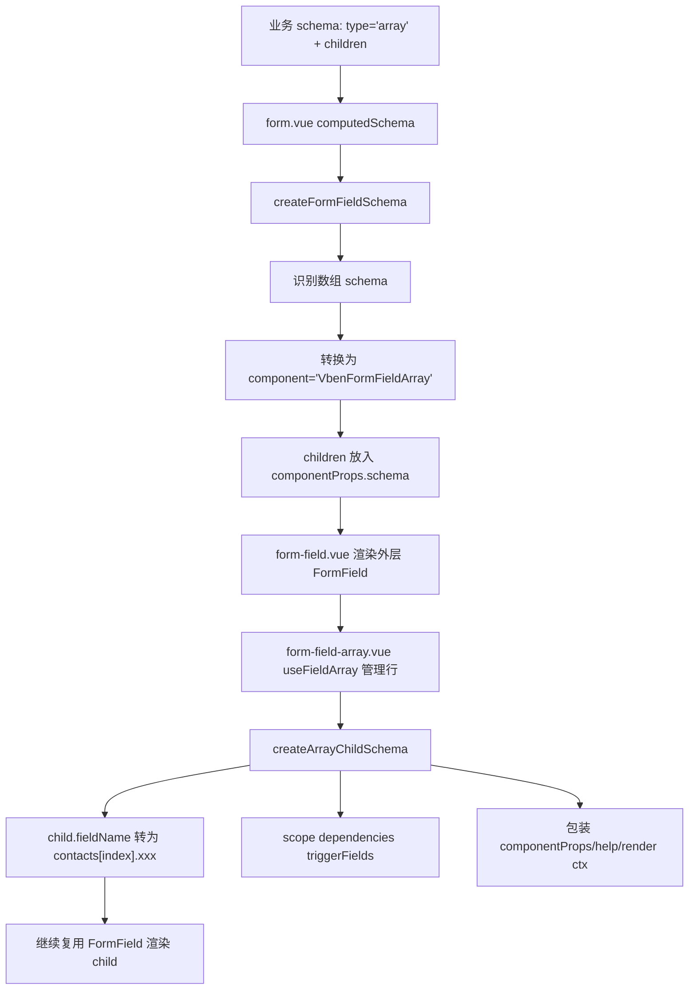

# Form Array 数组字段用法

这个 demo 展示 `form-ui` 的数组字段 schema 写法。业务侧推荐使用 `type: 'array' + children` 描述数组结构，不需要直接指定 `component: 'VbenFormFieldArray'`。

示例页面：

- `/vue-vben-admin/playground/src/views/demos/form-array/index.vue`

核心实现：

- `/packages/@core/ui-kit/form-ui/src/form-render/schema.ts`
- `/packages/@core/ui-kit/form-ui/src/components/form-field-array.vue`
- `/packages/@core/ui-kit/form-ui/src/form-api.ts`

## 快速开始

```ts
const schema: VbenFormSchema[] = [
  {
    type: 'array',
    fieldName: 'contacts',
    label: '联系人',
    formItemClass: 'col-span-1 md:col-span-2',
    defaultValue: [
      {
        enabled: true,
        name: '张三',
        phone: '10086',
        role: 'owner',
      },
    ],
    rules: z.array(z.any()).min(1, '请至少添加一个联系人'),
    arrayProps: {
      addButtonText: '添加联系人',
      min: 1,
      max: 5,
      createRow: () => ({
        enabled: true,
        name: '',
        phone: '',
        role: 'member',
      }),
    },
    children: [
      {
        component: 'Input',
        fieldName: 'name',
        label: '姓名',
        rules: z.string().min(1, '请输入姓名'),
      },
      {
        component: 'Select',
        fieldName: 'role',
        label: '角色',
        rules: 'selectRequired',
        componentProps: {
          options: [
            { label: '负责人', value: 'owner' },
            { label: '成员', value: 'member' },
          ],
        },
      },
    ],
  },
];
```

## 字段职责

### `type: 'array'`

声明这是一个数组字段。渲染前会被内部转换为 `VbenFormFieldArray`，所以业务 schema 不需要写具体组件名。

### `fieldName`

数组字段名。假设为 `contacts`，第 1 行子字段 `name` 会被转换成：

```ts
contacts[0].name;
```

### `children`

数组每一行的子字段定义。每个 child 都是完整的 `FormSchema`，可以继续使用：

- `component`
- `componentProps`
- `rules`
- `dependencies`
- `defaultValue`
- `help`
- `suffix`
- `renderComponentContent`
- `formFieldProps`
- `disabled`
- `hide`
- `labelClass`
- `controlClass`

### `arrayProps`

传给数组编辑器的配置：

| 字段            | 说明                     |
| --------------- | ------------------------ |
| `addButtonText` | 新增按钮文案             |
| `actionText`    | 操作列表头文案           |
| `emptyText`     | 空数据文案               |
| `min`           | 最少行数，达到后禁用删除 |
| `max`           | 最多行数，达到后禁用新增 |
| `showIndex`     | 是否显示序号             |
| `createRow`     | 新增行时生成默认数据     |

## 校验建议

数组父级 `rules` 建议只写数组级规则，例如至少一行：

```ts
rules: z.array(z.any()).min(1, '请至少添加一个联系人');
```

每个子字段的必填、长度、格式校验写在 children 自己的 `rules`：

```ts
{
  component: 'Input',
  fieldName: 'name',
  label: '姓名',
  rules: z.string().min(1, '请输入姓名'),
}
```

不要在父级数组规则里重复写 `z.object({ name: ... })`，否则某一行子字段失败时，父级数组也会失败，容易出现重复错误提示。

## dependencies 用法

children 里的 `dependencies.triggerFields` 默认是“当前行相对路径”。例如：

```ts
{
  component: 'Input',
  fieldName: 'phone',
  label: '电话',
  dependencies: {
    triggerFields: ['role'],
    componentProps: (_values, _form, _api, ctx) => ({
      disabled: ctx?.row?.role === 'viewer',
      placeholder:
        ctx?.row?.role === 'viewer' ? '观察员无需电话' : '请输入电话',
    }),
  },
}
```

在第 1 行中，`triggerFields: ['role']` 会被转换成：

```ts
contacts[0].role;
```

回调多了一个可选 `ctx` 参数：

| 字段                    | 说明                                     |
| ----------------------- | ---------------------------------------- |
| `ctx.row`               | 当前行数据                               |
| `ctx.rowIndex`          | 当前行索引                               |
| `ctx.rowPath`           | 当前行路径，例如 `contacts[0]`           |
| `ctx.arrayField`        | 数组字段名，例如 `contacts`              |
| `ctx.fieldName`         | 当前真实字段名，例如 `contacts[0].phone` |
| `ctx.originalFieldName` | 原始 child 字段名，例如 `phone`          |
| `ctx.rootValues`        | 表单完整值                               |

如果 child 需要依赖表单根字段，可以使用 `$root.` 前缀：

```ts
dependencies: {
  triggerFields: ['$root.planName'],
  componentProps: (values) => ({
    disabled: !values.planName,
  }),
}
```

如果想显式写当前行字段，也可以使用 `$row.` 前缀：

```ts
triggerFields: ['$row.role'];
```

## 提交值转换

数组字段的提交转换使用表单级 `codec`，一次处理完整表单值：

```ts
function encodeArrayFormValues(values: Readonly<ArrayFormValues>) {
  return {
    ...values,
    contacts: values.contacts.map((contact) => ({
      ...contact,
      name: contact.name.trim(),
      phone: contact.phone?.trim() || undefined,
    })),
  };
}

const [Form] = useVbenForm({
  codec: {
    decode: decodeArrayFormValues,
    encode: encodeArrayFormValues,
  },
  schema,
});
```

如果要写根字段，用 `$root.`：

```ts
setValue('$root.firstContactPhone', value);
```

如果要显式写当前行字段，用 `$row.`：

```ts
setValue('$row.phone', value);
```

## updateSchema 用法

可以用父级路径更新 child schema：

```ts
formApi.updateSchema([
  {
    fieldName: 'contacts.phone',
    rules: z.string().min(5, '电话至少 5 位'),
  },
]);
```

如果传入带索引路径，也会更新对应 child 定义：

```ts
formApi.updateSchema([
  {
    fieldName: 'contacts[0].phone',
    rules: z.string().min(5, '电话至少 5 位'),
  },
]);
```

注意：`updateSchema` 更新的是 schema 定义，不是单行实例。因此 `contacts[0].phone` 这种写法目前会解析到 child `phone`，实际影响所有行的该列。

## 新增行默认值

优先使用 `arrayProps.createRow`：

```ts
arrayProps: {
  createRow: () => ({
    name: '',
    role: 'member',
    phone: '',
    enabled: true,
  }),
}
```

没有 `createRow` 时，会根据 children 的 `defaultValue` 生成行数据；没有 defaultValue 的字段会给 `null`。

## 内部流程

数组字段从 schema 到渲染大致是这条链路：



几个关键点：

- 外层 `type: 'array'` 只是语义声明。
- 具体展示仍复用内部 `VbenFormFieldArray`。
- child 最终仍然走 `FormField`，所以现有 FormSchema 能力不会丢。
- `dependencies` 不改核心调用链，而是在 `createArrayChildSchema` 里做路径和 ctx 适配。
- `updateSchema` 在 `FormApi` 里递归处理 children；提交转换由表单级 `codec` 统一完成。

## 小屏幕展示

`form-field-array` 在大屏下按表格式 grid 展示，在小屏下每行转为纵向堆叠，并显示每个 child 的 label。业务侧通常不需要额外处理移动端布局。

## 兼容旧写法

旧写法仍可用：

```ts
{
  component: 'VbenFormFieldArray',
  fieldName: 'contacts',
  componentProps: {
    schema: [...],
  },
}
```

新代码推荐：

```ts
{
  type: 'array',
  fieldName: 'contacts',
  children: [...],
}
```
